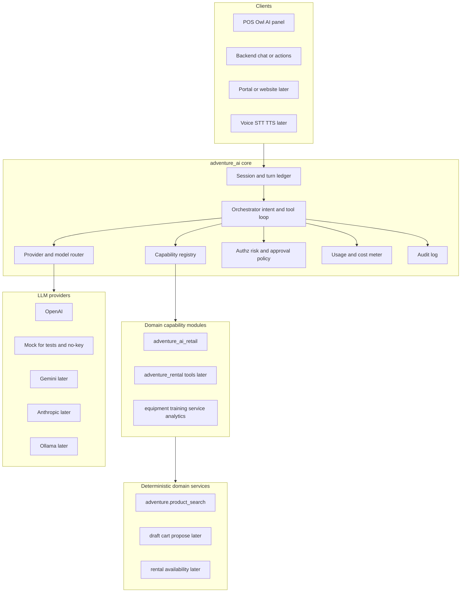

# AdventurePOS AI architecture

## Status

Accepted direction for the AdventurePOS AI platform capability (Phase 0 / Phase 1). Prefer Adventure-owned runtime on Odoo **19 Community**, aligned with Odoo Enterprise AI *concepts*, without a hard Enterprise dependency.

## Goals

- First-class AI interaction for POS, backend ops, analytics, catalog work, and (later) customer-facing surfaces—not a bolted-on generic chatbot.
- LLM as an **intent/reasoning** layer that invokes **deterministic Adventure capabilities**.
- Modular domain registration, auditability, authorization, propose/confirm writes, provider neutrality, and per-tenant usage/cost awareness.
- Usable from **backend Odoo** and the **POS Owl** frontend via the same tool contracts.

## Investigation summary (this stack)

| Fact | Implication |
|------|-------------|
| Target is Odoo **19.0 Community** (`Dockerfile` `FROM odoo:19.0`) | Native Odoo AI app is **not** in the image |
| Odoo 19 AI (Agents, Topics, Tools, Sources, Ask AI, AI Fields, AI Server Actions) is **Enterprise-only** | Cannot hard-depend on `ai.*` for platform AI |
| Adventure product code had **no** in-app AI before this work | Greenfield Adventure runtime is required |
| Tenants are **one PostgreSQL DB per shop** | AI sessions, keys, and usage logs stay tenant-local |
| POS is Owl + registries ([`adventure_pos`](../../addons/adventure_pos/)) | POS must call the same orchestrator/capabilities as backend |

Official EE conceptual reference: [Odoo 19 AI](https://www.odoo.com/documentation/19.0/applications/productivity/ai.html), [Agents](https://www.odoo.com/documentation/19.0/applications/productivity/ai/agents.html), [AI server actions](https://www.odoo.com/documentation/19.0/applications/productivity/ai/server-actions.html).

## Edition strategy (dual-track)

1. Ship AI on **Community** without requiring Enterprise.
2. AdventurePOS owns capability contracts, security, audit, metering, and propose/confirm.
3. Optional later: `adventure_ai_odoo_ee` adapter maps Adventure capabilities into EE Topics / Use-in-AI tools—**never** invert so core AI requires EE.
4. Study [OCA/ai](https://github.com/OCA/ai) and [apexive/odoo-llm](https://github.com/apexive/odoo-llm) for patterns only; **no hard dependency**.

## Target architecture

**Core idea:** the model may only call **registered Adventure capabilities**. Capabilities call **ordinary domain services**. Consequential writes use **propose → human confirm → apply** unless an explicit per-capability auto policy is added later.

**External orchestration service:** not required for v1. Revisit only for shared master-catalog RAG, centralized billing aggregation, high-volume voice, or anonymized cross-tenant intelligence—not for tenant business-data tool loops.

## Module structure

### Shipped in Phase 1

| Module | Role |
|--------|------|
| [`adventure_ai`](../../addons/adventure_ai/) | Core runtime: providers, capability registry, sessions, usage/audit, orchestrator, security groups, settings |
| [`adventure_ai_retail`](../../addons/adventure_ai_retail/) | Retail domain: `adventure.product_search`, `search_products` capability, POS Owl NL search panel |

### Growth pattern

Prefer **domain modules registering capabilities** into `adventure_ai` (same idea as POS mode registry / provider connectors). Add dedicated `adventure_ai_*` packs when AI is a sellable add-on or the domain module must remain installable without AI.

Future optional packs: rental, equipment, training, service, analytics, catalog, customer, and `adventure_ai_odoo_ee`.

## Boundaries

### Odoo-native AI vs AdventurePOS

| Layer | Owner |
|-------|--------|
| EE Ask AI / Topics / Sources / AI Fields / AI Server Actions | Odoo Enterprise (optional) |
| Capability contracts (`search_products`, …) | **AdventurePOS** |
| Business rules / ORM writes | **AdventurePOS domain services** |
| Audit, metering, quotas, propose/confirm | **AdventurePOS** |
| EE adapter | Optional later module |

Vocabulary mapping: Agent ≈ session + profile; Topic ≈ capability pack; Tool ≈ registered capability; Source ≈ later grounding; AI server-action manager/worker ≈ orchestrator + deterministic handler.

### AI reasoning vs deterministic logic

**Model may:** choose capabilities, fill typed args, summarize results, phrase recommendations from returned candidates.

**Model must not:** call arbitrary `env[model]`, invent model/method names, run SQL, or run tools as a sudo/system user by default.

**Services stay AI-agnostic:** e.g. `adventure.product_search.search_products(...)` is callable from POS without an LLM (typed search, tests, fallback).

## Security and permissions

- **Tenant isolation:** database boundary; no cross-tenant tool calls.
- **Execution identity:** capabilities run as the **calling user** (POS cashier / backend user). Standard ACLs and record rules apply inside domain services.
- **Groups:** `adventure_ai.group_user` (invoke AI), `adventure_ai.group_manager` (settings, usage review).
- **Risk classes:** `read`, `propose`, `money`, `inventory`, `pii_write`. Phase 1 only ships `read`.
- **Secrets:** provider API keys in Settings / `ir.config_parameter` (never committed). Prefer tenant settings; env vars may supply platform-managed defaults in some deployments.
- **Prompt injection:** treat tool arguments as untrusted; validate types/ranges in handlers; never concatenate raw model text into ORM domains.

## Provider and model abstraction

Configured under Settings → Adventure AI:

| Parameter | Purpose |
|-----------|---------|
| Provider | `openai` or `mock` (Phase 1) |
| OpenAI API key / model / base URL | OpenAI-compatible chat completions + tools |
| Default task class | `route` (cheap) vs `reason` (stronger)—routing expands later |

Python contract: `complete(messages, tools) -> assistant message + tool_calls`.

`mock` always emits a `search_products` tool call using the latest user text—enables POS demos and CI without a paid key.

## Usage and cost metering

Model `adventure.ai.usage` (per tenant DB) stores: user, session, feature/domain, capability, provider, model, token counts, estimated cost, latency, success/error.

Later: aggregates, soft/hard quotas, commercial tiers. Metering must remain authoritative even if an EE adapter is added.

## Phased roadmap

| Phase | Scope |
|-------|--------|
| **0** | Architecture doc (this page), spike checklist |
| **1** | `adventure_ai` + `adventure_ai_retail`; read-only POS NL product search |
| **2** | Propose/confirm; additional domain **read** tools (e.g. rental) when services are real |
| **3** | Profiles, optional grounding/RAG, backend Ask-style UX, model routing, soft quotas |
| **4** | Catalog enrichment with human review, analytics over approved metrics, portal assistant, optional EE adapter, voice |

**Deferred:** unrestricted ORM tools, autonomous money/inventory mutations, cross-tenant LLM memory, hard OCA/`odoo-llm` dependency, empty stub packs on day one.

## First vertical slice

**POS natural-language product search (read-only).**

Acceptance:

1. Cashier opens the POS AI panel and enters a query (e.g. “men’s 7mm semi-dry size L”).
2. Orchestrator may only invoke `search_products` for this profile.
3. Ranked hits appear; cashier adds via normal POS line APIs (not LLM writes).
4. Usage row recorded with `feature=pos_retail`.
5. Users without `adventure_ai.group_user` cannot invoke.
6. Tests cover search service + capability schema; mock provider covers orchestrator without network.

Offline POS: AI is online-only; UI must show a clear error when the backend/orchestrator is unreachable.

## Community Edition spike checklist

Environment note: the Cloud Agent workspace used for the initial implementation did **not** include a running Odoo/Docker daemon, so the following were validated by **code and docs inspection** plus **unit-style tests** intended to run inside the Odoo 19 image. Re-run on a local/sandbox compose stack before calling latency/cost numbers “measured.”

| Check | Result / how to verify |
|-------|-------------------------|
| Provider call from Odoo worker | `adventure.ai.provider` OpenAI adapter uses HTTPS chat completions; configure key under Settings → Adventure AI; invoke `adventure.ai.orchestrator.run_turn` from shell |
| POS `orm.call` round-trip | POS panel calls `adventure.ai.orchestrator.run_turn` via `this.env.services.orm.call` (same pattern as other backend Owl `orm.call` usages) |
| ACL under POS user | Orchestrator checks `adventure_ai.group_user`; grant that group to POS users who should use AI |
| Mock path without API key | Provider `mock` or missing key with mock selected: still exercises registry, session, usage, and `search_products` |
| EE AI present? | **No** on Community image—confirm with Apps list / absence of `ai` module |

### Experiments still open

1. End-to-end POS latency with a live model (target usable ~2–3s; streaming later).
2. EE trial: can EE Topics call Adventure handlers without forking domain logic?
3. Search quality: deterministic search vs LLM query rewrite vs embeddings (Phase 1 = deterministic search + LLM tool routing).
4. Cost per 100 POS searches at chosen models.
5. Graceful degradation when offline.

### Commercial open questions

- Platform-managed keys vs customer BYO vs hybrid.
- AI as always-on platform module vs premium installable app (Phase 1 modules are installable; packaging TBD).
- Phase 2 proposal UX in POS (modal vs side panel).

## Related docs

- [AdventurePOS vertical module architecture](adventurepos-vertical-module-architecture.md)
- [Tenant provisioning](tenant-provisioning.md)
- [Setup](../setup.md) (provider keys)
- Module READMEs: [`addons/adventure_ai/README.md`](../../addons/adventure_ai/README.md), [`addons/adventure_ai_retail/README.md`](../../addons/adventure_ai_retail/README.md)
