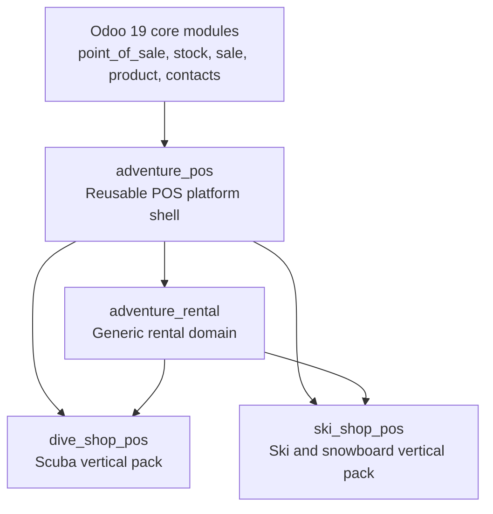

# AdventurePOS Vertical Module Architecture

AdventurePOS is the reusable platform layer for adventure sports operators. Industry packs such as DiveShopPOS and SkiShopPOS extend the platform through documented backend hooks, POS frontend registries, and workflow slots.

The core rule is strict: scuba, ski, bike, kayak, climbing, or any other industry-specific behavior must not be implemented directly in the generic `adventure_pos` module. Generic modules provide extension points and shared operating patterns. Vertical modules fill those extension points with industry-specific fields, validations, package templates, and routing decisions.

## Module Layers



## `adventure_pos`

`adventure_pos` owns the reusable AdventurePOS register experience inside Odoo POS. It is the platform shell, not a vertical implementation.

Dependencies:

- `point_of_sale`
- `stock`
- `sale`
- `product`
- `contacts`

Responsibilities:

- Custom AdventurePOS register layout inside Odoo POS.
- Always-visible primary workflow actions: `Sale`, `Rental`, `Pickup`, `Return`, `Orders`, `Customer`.
- Theme-compatible Odoo POS UI using OWL components, QWeb templates, Odoo POS services, Bootstrap/Odoo semantic classes, and POS asset bundles.
- POS control/action framework for registering workflow buttons and screens.
- Shared scanner workflow shell.
- Shared customer hooks.
- Shared order/cart integration hooks.
- Shared payment/deposit integration hooks.
- Shared popup/dialog patterns.
- Frontend and backend extension slots for vertical modules.

Non-responsibilities:

- Rental asset lifecycle logic.
- Scuba package, tank, regulator, certification, waiver, or fill station behavior.
- Ski sizing, DIN, binding, tune, wax, or recommendation behavior.
- Independent frontend app, custom theme system, React, Tailwind, Material UI, or external UI frameworks.

### POS Register Layout

The AdventurePOS register is an Odoo POS extension. It must not fork POS into a separate app.

The register shell should extend the Odoo 19 POS frontend with OWL components and QWeb templates. The primary workflow bar should remain visible at the register level:

```text
[Sale] [Rental] [Pickup] [Return] [Orders] [Customer]
```

These actions must not be hidden only in Odoo's overflow menu. The default Odoo POS controls can still exist, but AdventurePOS workflows are first-class controls because they represent daily operating modes.

Recommended frontend structure:

```text
adventure_pos/
  static/src/pos/
    components/register_shell/
      register_shell.js
      register_shell.xml
      register_shell.scss
    services/
      adventure_action_service.js
      adventure_scanner_service.js
      adventure_extension_service.js
    registries/
      workflow_registry.js
      validation_registry.js
      receipt_metadata_registry.js
```

The shell should use semantic classes and inherit Odoo POS styling. Any SCSS should express layout and spacing only, using Odoo/Bootstrap variables where needed.

### Frontend Extension Contract

`adventure_pos` should expose lightweight registries instead of hard-coded vertical branches.

Suggested frontend extension points:

| Slot | Purpose | Generic owner |
| --- | --- | --- |
| `workflow.actions` | Add or modify POS workflow actions. | `adventure_pos` |
| `scanner.handlers` | Route scanner payloads to workflow handlers. | `adventure_pos` |
| `customer.requirements` | Add customer-level POS warnings or blockers. | `adventure_pos` |
| `cart.hooks` | Add metadata or validation before cart/order changes. | `adventure_pos` |
| `payment.deposit_hooks` | Add deposit prompts or release rules. | `adventure_pos` |
| `dialogs` | Register reusable popup/dialog components. | `adventure_pos` |
| `receipt.metadata` | Add receipt data without changing core receipt rendering. | `adventure_pos` |

Vertical modules register implementations into these slots from their own asset bundles.

## `adventure_rental`

`adventure_rental` extends and integrates Odoo's standard Rental capabilities for adventure sports operators. It depends on the platform shell but remains industry-neutral.

It should not duplicate standard Odoo rental order, pricing, schedule, invoicing, or stock integration logic unless the standard flow is insufficient for scanner-first POS operations, operator pickup/return workflows, vertical package behavior, or field-level rental asset handling.

Dependencies:

- `adventure_pos`
- `stock`
- Odoo Rental / rental sale capabilities, when available in the target Odoo 19 deployment

Responsibilities:

- Scanner-first checkout and check-in workflows.
- POS-native pickup and return screens.
- Rental asset assignment for serialized, pooled, or package-based equipment.
- Asset condition tracking at checkout and return.
- Maintenance routing after inspection, damage, service due, or fill-required outcomes.
- Industry-neutral package abstractions that vertical modules can specialize.
- Availability checks that reuse Odoo rental availability where possible and add POS/operator constraints only where needed.
- Checkout and check-in state synchronization with Odoo rental orders.
- Damage, fill, late fee, deposit, and adjustment handling extensions.
- Utilization reporting based on Odoo rental data plus AdventureRental asset/operator events.
- Vertical extension slots for requirements, validation, fees, routing, and receipt metadata.

Non-responsibilities:

- BCD, wetsuit, fin, tank, regulator, certification, waiver, or fill station fields.
- Boot size, skier profile, DIN, binding, helmet, tune, wax, or ski-length logic.
- Vertical-specific validation rules.

### Backend Model Boundary

Recommended generic models and integration roles:

| Model | Purpose |
| --- | --- |
| Odoo rental order / rental sale models | Source of truth for standard rental order lifecycle, pricing, scheduling, invoicing, and stock integration. |
| `adventure.rental.asset` | Adventure operator view of rentable serialized or pooled assets. |
| `adventure.rental.assignment` | Link between Odoo rental order lines, package components, and physical assets scanned or selected by the operator. |
| `adventure.rental.package.template` | Industry-neutral package definition with component requirements that can resolve to Odoo rentable products. |
| `adventure.rental.condition.log` | Checkout/check-in condition snapshots and damage notes. |
| `adventure.rental.fee.rule` | Generic late, damage, deposit, and adjustment rules. |
| `adventure.rental.maintenance.event` | Generic service, hold, repair, retirement, and inspection events. |

Vertical modules should inherit these models to add fields and constraints. Generic models should contain neutral names such as `size_code`, `condition_state`, `service_due_date`, or `requirement_payload` only when they are truly reusable across industries.

Avoid introducing a parallel reservation/order header unless there is a concrete POS workflow requirement that cannot be represented by Odoo's rental order model. When additional AdventureRental records are needed, they should reference Odoo rental orders and order lines instead of replacing them.

### Rental Extension Contract

`adventure_rental` should expose backend hooks and frontend registries for:

- Customer requirements.
- Asset requirements.
- Package configuration.
- Reservation validation.
- Checkout validation.
- Return inspection.
- Fee calculation.
- Post-return routing.
- Receipt metadata.

Suggested backend hook shape:

```python
class AdventureRentalReservation(models.Model):
    _name = "adventure.rental.reservation"

    def _get_customer_requirement_results(self):
        return []

    def _get_reservation_validation_results(self):
        return []

    def _get_checkout_validation_results(self):
        return []

    def _get_return_inspection_results(self):
        return []

    def _get_fee_line_candidates(self):
        return []

    def _get_post_return_routes(self):
        return []

    def _get_receipt_metadata(self):
        return {}
```

Each hook should return structured results, not UI strings only. A useful result shape is:

```python
{
    "code": "generic_code",
    "severity": "info|warning|blocker",
    "message": "Operator-facing message",
    "record_model": "optional.model",
    "record_id": 0,
    "payload": {},
}
```

This lets POS dialogs, receipts, logs, and reports consume the same validation output.

## `dive_shop_pos`

`dive_shop_pos` is a vertical pack for scuba shops. Removing it must leave a usable generic AdventurePOS and AdventureRental installation.

Dependencies:

- `adventure_pos`
- `adventure_rental`

Responsibilities:

- Scuba rental packages.
- BCD size.
- Wetsuit size.
- Fin size.
- Weight preferences.
- Tank visual inspection dates.
- Tank hydro dates.
- Tank gas/fill status.
- Regulator service dates.
- Certification verification.
- Waiver checks.
- Fill station return routing.

Implementation pattern:

- Inherit `adventure.rental.asset` for scuba equipment fields.
- Inherit package templates for scuba package definitions.
- Register customer requirement hooks for certification and waiver status.
- Register asset requirement hooks for tank VIP/hydro and regulator service status.
- Register checkout validation hooks for sizing, weight, and required scuba package components.
- Register return inspection hooks for tank pressure/fill status and regulator condition.
- Register post-return routing hooks for fill station, service bench, or normal availability.
- Register receipt metadata for certification, waiver, package, and tank identifiers.

`dive_shop_pos` must not patch generic rental code with scuba-specific conditionals such as `if activity_type == "scuba"`. It should contribute behavior through inheritance, registries, and hook methods.

## `ski_shop_pos`

`ski_shop_pos` is the future ski and snowboard vertical pack.

Dependencies:

- `adventure_pos`
- `adventure_rental`

Responsibilities:

- Boot size.
- Skier height and weight.
- Ability level.
- DIN setting workflow.
- Ski length recommendations.
- Binding adjustment workflow.
- Helmet sizing.
- Tune/wax routing.
- Ski package templates.
- Ski/snowboard return inspection.

Implementation pattern:

- Inherit generic rental assets for ski, snowboard, boot, binding, and helmet fields.
- Register package configuration extensions for ski and snowboard packages.
- Register checkout validation for DIN confirmation, binding checks, and package completeness.
- Register recommendation services for ski length without coupling the core package model to ski rules.
- Register return inspection and post-return routing for tune/wax/service bench outcomes.

## Migration From Current Rental POS Work

The current untracked `adventops_rental_pos` module should be treated as prototype or staging work unless it is intentionally renamed. The target architecture should converge on:

- `adventure_pos`: shared POS shell, workflow buttons, frontend services, and generic extension registries.
- `adventure_rental`: generic rental models, rental POS workflows, availability, deposits, fees, assignments, and condition workflows.
- `dive_shop_pos`: scuba-specific fields, validations, package templates, and routing.

Code that is currently generic rental behavior can move into `adventure_rental`. Code that mentions scuba-specific concepts belongs in `dive_shop_pos`.

## Acceptance Criteria

- Installing only `adventure_pos` gives a usable AdventurePOS register shell with visible primary workflow controls.
- Installing `adventure_pos` plus `adventure_rental` gives a usable generic rental system with no scuba or ski assumptions.
- Installing `dive_shop_pos` adds scuba workflows without editing generic core behavior.
- Uninstalling `dive_shop_pos` leaves generic POS and rental workflows usable.
- Future `ski_shop_pos` can add ski workflows through the same slots used by `dive_shop_pos`.
- POS frontend code uses Odoo 19 OWL, QWeb templates, POS services/state management, popup/dialog patterns, and POS asset bundles.
- UI styling respects Odoo POS theme styling, Bootstrap variables, SCSS inheritance, and semantic classes.
