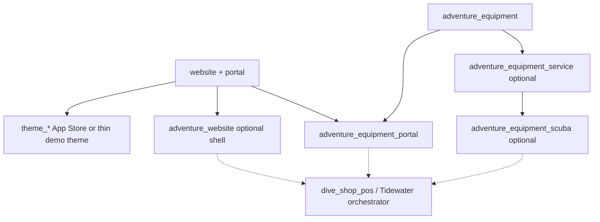

# Client Web Portal Architecture

!!! warning "Draft / planning — not implemented"

    This page is a **planning and architecture review** for the AdventurePOS **client web portal** (customer-facing Odoo Website + Portal). It is **not** shipped behavior. Do **not** implement controllers, themes, portal ACL, or Tidewater portal seed until the team answers the **remaining** open questions below and explicitly kicks off a build phase. Already confirmed: hosting pattern **A** (minimal homepage MVP) and the Tidewater demo journey (homepage → login → list → detail → register external → staff verify).

**Audience:** Product, operations, and developers planning customer self-service for adventure shops (dive, ski, etc.) on the Adventure POS Odoo stack.

**Related today:**

- Equipment lifecycle design — draft PR [#73](https://github.com/bsileo/adventure-pos-odoo/pull/73) (canonical doc path once merged: `docs/architecture/equipment-management.md`); proposes `adventure_equipment_portal` as Phase 4
- Equipment registry implementation — draft PR [#74](https://github.com/bsileo/adventure-pos-odoo/pull/74) (`adventure_equipment`); service/scuba packs [#79](https://github.com/bsileo/adventure-pos-odoo/pull/79) / [#80](https://github.com/bsileo/adventure-pos-odoo/pull/80)
- [AdventurePOS vertical module architecture](adventurepos-vertical-module-architecture.md) — platform vs vertical packs; Community / Odoo-native UI bias
- [Tidewater demo seed](tidewater-demo-seed.md) — module-owned demo contributors for sandbox demos
- [Core data model](../data-model/core-model.md) — one operational tenant DB per shop; ecommerce/website visibility is tenant-local
- [Tenant provisioning](tenant-provisioning.md) — per-tenant module install and baseline config
- [Scuba training and scheduling (future)](scuba-training-scheduling.md) — later customer portal session selection
- Third-party themes: [`addons/README.md`](../../addons/README.md) (Odoo **19.0** App Store themes under `addons/`)

**Out of scope for this plan:** website **content migration** from legacy shop sites into Odoo (handled by a separate migration project). This plan assumes greenfield or parallel Odoo Website setup, not cutover of existing marketing pages.

**Published docs:** when this page is merged, it will appear on [Event Ops Developer Docs](https://bsileo.github.io/adventure-pos-odoo/).

---

## Decisions confirmed (review)

| # | Decision | Status |
|---|----------|--------|
| 1 | **Hosting pattern = A (Odoo-hosted full site).** AdventurePOS will provide full client websites on Odoo Website; the customer portal is part of that site, not a separate hybrid/portal-only product. Tidewater demos use the same pattern. | **Confirmed** |
| 2 | **This workstream keeps the public website minimal.** A simple Tidewater homepage with **Sign in / login** and a link into the **equipment portal** is enough for MVP. Rich marketing pages, multi-page IA, and content migration remain out of scope here. | **Confirmed** |
| 3 | **Tidewater demo customer journey (MVP).** Homepage → login → list gear → asset detail → register external item → staff verify. **Not** mandatory for this demo: orders history, profile edit, or a documents-only flow. | **Confirmed** |

Remaining open questions (theme choice, auth, equipment field editability, etc.) are listed below and do not reopen these decisions.

---

## Purpose

Define how AdventurePOS will give each shop a **branded customer portal** that:

1. Reuses **off-the-shelf Odoo Website + Portal** (Community) as far as practical.
2. Lives on the shop’s **Odoo-hosted website** (pattern A), with theme and branding so portal and public pages share one presence—expandable to fuller retail sites over time.
3. Exposes domain features—starting with **customer equipment**—through installable Adventure modules rather than a separate SPA or custom CMS.
4. Can be demonstrated on the **Tidewater Dive Shop** sandbox with a minimal public homepage, sample portal customers, and gear.

---

## Current repository findings

| Area | Finding |
|------|---------|
| **Odoo version / edition** | **19.0** Community image (`Dockerfile` / compose). Enterprise Website themes / eCommerce extras are **not** assumed; design Community-first with optional Enterprise bridges later. |
| **Custom website/portal modules** | **None** under `addons/` on `develop`. No `website_*` / `*_portal` Adventure modules yet. |
| **Equipment domain** | Designed in draft equipment architecture ([PR #73](https://github.com/bsileo/adventure-pos-odoo/pull/73)); Phase 1 staff registry and later service/scuba packs exist as **in-flight draft PRs**. Portal is explicitly **deferred** to `adventure_equipment_portal`. |
| **Rental / training** | Shop rental fleet is a **sibling** domain (`adventure.rental.asset`). Training design mentions portal session selection as a **later** phase—do not block portal MVP on training. |
| **Tenant model** | **One PostgreSQL DB per shop.** Website, theme, portal users, and equipment data are all **tenant-local**. |
| **Themes today** | Documented path: install Odoo **19.0** App Store theme modules under `addons/` ([`addons/README.md`](../../addons/README.md)). No first-party Adventure “shop theme” module yet. |
| **Tidewater seed** | Seeds company, rental products/assets, and story customers (e.g. certified / uncertified divers). **No** portal users, website pages, or customer-owned equipment assets in the orchestrator yet. |
| **Migrations** | D360 and related runbooks are separate; **website content migration is out of scope** here. |

---

## Product framing

### What “client web portal” means here

For each tenant shop:

| Layer | Role | Odoo building blocks (preferred) |
|-------|------|----------------------------------|
| **Public website shell** | Brand, navigation, marketing pages the shop chooses to host in Odoo | `website`, theme module(s), Website Builder / pages, company logo & colors |
| **Authenticated portal** | Logged-in customer self-service | `portal`, `auth_signup` (or invite-only), `portal` home + custom portal menus |
| **Domain features** | Equipment (first), later orders, documents, training, service booking, etc. | Thin `adventure_*_portal` modules: Controllers + QWeb + record rules |
| **Staff backend** | Authoritative ops (verify gear, complete service, manage customers) | Existing backend apps (`adventure_equipment`, etc.) — unchanged source of truth |

The portal is **not** a second application with its own database or React/Tailwind frontend. That matches the vertical architecture rule: prefer Odoo OWL/QWeb and avoid independent frontend apps for Adventure surfaces ([vertical module architecture](adventurepos-vertical-module-architecture.md)).

### Relationship to the wider retail / online presence

**Confirmed product direction: pattern A — Odoo-hosted full site.** Future clients get websites on Odoo; Tidewater demonstrates that path. Hybrid (B) and portal-only (C) are not the target architecture for AdventurePOS-delivered sites. Feature portal modules should still avoid hard-coding assumptions that *many* marketing pages exist, so a **minimal homepage MVP** and a later richer site both work without rewriting equipment portal code.

| Pattern | Description | Status for AdventurePOS |
|---------|-------------|-------------------------|
| **A. Odoo-hosted site** | Marketing + shop + portal all on Odoo Website | **Chosen.** Theme + menus integrate portal under “My Account” / “My Equipment”. MVP public surface may be a single homepage. |
| **B. Hybrid** | Marketing on external CMS; Odoo hosts portal on a subdomain | Not the product default; do not optimize Tidewater or platform shell for this |
| **C. Minimal portal-only** | Little/no public marketing; invite links into `/my` only | Not the product default; insufficient for “we provide full websites” |

### MVP public website scope (this workstream)

Keep the Odoo Website **thin** while still being pattern A:

- One **homepage** (Tidewater-branded chrome: logo, shop name, short blurb).
- Clear **Sign in / Log in** entry to the portal.
- A visible path to **My Equipment** (menu and/or homepage CTA) once the customer is authenticated (and a login prompt when not).
- No requirement in this stream for multi-page marketing IA, blog, class catalogs, or migrated legacy content.

**Website content migration** (importing existing pages/media from legacy sites) remains **out of scope** for this workstream.

---

## Architectural principles

1. **Odoo-native first** — Prefer `website`, `portal`, `auth_signup`, `mail`, `ir.attachment`, Website themes, and Controllers/QWeb over custom SPAs.
2. **Feature modules, not a mega-portal** — Shell/branding configuration stays thin; each domain ships `adventure_<domain>_portal` (or portal controllers inside an optional portal extra) that can be installed per tenant.
3. **Same tenant DB** — Portal users are `res.users` with portal group linked to `res.partner`; record rules enforce “own partner only” (plus any agreed household sharing).
4. **Staff remains authoritative** — Customer-created or edited records use verification / limited fields (already sketched for equipment).
5. **Theme-compatible UI** — Portal templates use Bootstrap / Odoo Website semantic classes and SCSS variables so App Store or custom themes re-skin them without forking controllers.
6. **Community-first** — No hard dependency on Enterprise eCommerce, Appointment, or proprietary themes for MVP.
7. **Demo-ready** — Any portal-capable module includes a **Tidewater contributor** (portal users + sample domain rows) per [tidewater-demo-seed.md](tidewater-demo-seed.md).
8. **Configuration as code** for agreed sandbox defaults (website name, portal menus, auth settings) — not only UI clicks on one database ([agent-rules](../agent-rules.md)).

---

## Proposed module shape

### Platform / shell (new)

| Module (proposed) | Responsibility | Depends on |
|-------------------|----------------|------------|
| **`adventure_website`** (thin shell) | Tenant website baseline for pattern A: enable Website/Portal, company → website defaults, **minimal homepage** (login + equipment portal entry), shared SCSS/portal chrome helpers, documented theme install hooks | `website`, `portal`, `adventure_base` |
| **Theme choice** | Prefer **Odoo 19 App Store theme** (or a thin `theme_tidewater` only if we need first-party demo branding). Do not invent a full theme engine. Richer theming can follow; MVP may use default Website + Tidewater logo/colors. | `website` |

`adventure_website` should stay **domain-agnostic**. It must not own equipment models.

### Domain portal modules (pattern)

| Module | Responsibility | Status vs equipment roadmap |
|--------|----------------|------------------------------|
| **`adventure_equipment_portal`** | Customer list/detail of owned assets; register external gear; limited edits; portal-safe documents; portal record rules + HttpCase tests | Equipment Phase 4 (equipment architecture draft / PR #73) |
| Future: training / rental / orders portal extras | Same pattern: Controllers + QWeb + ACL | Later |

### Dependency sketch

Install sets (examples):

- **Staff only:** `adventure_equipment` (+ service/scuba) — no website required.
- **Portal + website (pattern A, MVP):** `website` + `portal` + thin theme/branding + `adventure_website` (minimal homepage) + `adventure_equipment` + `adventure_equipment_portal` (+ scuba for dive demos) + Tidewater seed contributors.
- **Later richer site:** same stack; add Website pages/menus/theme polish without changing equipment portal modules.

---

## Branding and theming strategy

### Recommended approach

1. **Primary:** Install a version-matched **Odoo 19 Website theme** under `addons/` (see [`addons/README.md`](../../addons/README.md)). Configure colors, logo (`res.company` / website), fonts, and header/footer in Website settings / theme options.
2. **Adventure portal templates:** Use semantic classes (`o_portal_*`, Bootstrap utilities, theme CSS variables). Avoid hard-coded brand colors in Python/XML for equipment (or other) portal pages.
3. **Optional thin first-party theme:** Only if App Store themes cannot express Tidewater/demo branding cleanly—e.g. `theme_adventure_tidewater` with logo, palette, and footer for sandbox demos. Keep it demo-oriented; production shops bring their own theme.
4. **Do not** build a parallel “Adventure theme system,” React design system, or Tailwind layer for the portal.

### Merge with wider online presence

| Concern | Approach |
|---------|----------|
| **Visual continuity** | Same logo, primary/secondary colors, typography via theme + company branding |
| **Navigation** | Website menus: public pages + “Sign in” / “My Account”; portal menu items registered by feature modules |
| **Domains** | Tenant website domain (or subdomain such as `account.shop.example`) configured per Odoo Website; document DNS/SSL in ops runbooks later |
| **SSO / social login** | Deferred unless product requires; MVP = email/password portal users |
| **eCommerce** | Out of MVP; `website_sale` may be added later without redesigning equipment portal modules |

---

## Equipment portal (first domain feature)

Align with the equipment lifecycle architecture (draft PR [#73](https://github.com/bsileo/adventure-pos-odoo/pull/73); canonical path `docs/architecture/equipment-management.md` once merged) rather than inventing a second equipment model.

### Customer capabilities (MVP target)

| Capability | Notes |
|------------|-------|
| Sign in / reset password | Standard portal + mail |
| See “My Equipment” list | Assets where `partner_id` is the portal user’s partner (household TBD) |
| Open asset detail | Nickname, category, serial/identifiers, snapshots, lifecycle state, verification state |
| Register gear purchased elsewhere | Creates `customer_claimed` / unverified asset; staff verifies in backend |
| Limited update | Nickname, notes, customer-visible photos/docs — **not** shop service completions |
| View portal-safe documents | Driven by document visibility / type whitelist |
| See shop-registered purchases | Assets created by staff (or later POS/sale bridge) appear once owned by the partner |

### Explicitly deferred from first portal slice

- Service scheduling / booking UI (needs service module + product decision)
- Kit/configuration / trip readiness
- Auto-create from every POS sale (equipment Phase 3 — can land before or after portal; portal should display either source)
- Household multi-owner editing (open question)
- Public catalog / ecommerce purchase of equipment
- Website migration of marketing content

### Security (must ship with first portal code)

- `ir.model.access` for `base.group_portal` (tight create/write)
- Record rules: only own partner’s assets (and agreed share set)
- Attachment / `adventure.equipment.document` portal visibility flags
- HttpCase tests for isolation (cannot read another customer’s gear)
- No leakage of manager-only fields (e.g. purchase price)

### Staff workflow

Customer registers or edits → asset appears as **unverified / customer-claimed** → staff verifies serial/photos → `shop_verified` → authoritative for warranty/service ops (policy details follow equipment service phases).

---

## Auth and identity

| Topic | Proposed default for review |
|-------|-----------------------------|
| **User model** | Standard `res.users` portal users linked 1:1 to customer `res.partner` |
| **Provisioning** | Staff invite from contact form and/or `auth_signup` self-registration with email validation |
| **Password reset** | Standard Odoo mail templates; sandbox needs outbound mail or documented test bypass |
| **Multi-contact households** | Open question — see below |
| **B2B / dive clubs** | Portal user on commercial partner vs individual — open question |
| **Staff impersonation** | Prefer “View as portal” only if Odoo provides a safe pattern; otherwise demo with real portal logins in Tidewater |

---

## Tidewater sandbox demonstration (end goal)

Once architecture is approved and modules exist, the shared **sandbox-diveshop** / Tidewater story should show:

1. **Pattern A, minimal public site:** Tidewater-branded **homepage** with shop identity, **Sign in**, and a clear path to the **equipment portal** (not a full marketing site yet).
2. At least **2–3 portal customers** with passwords documented for demos (fictional emails under Tidewater seed conventions).
3. Mix of equipment:
   - Shop-registered (staff-verified) gear “purchased at Tidewater”
   - Customer-registered external gear pending verification
   - Optional scuba service due dates if `adventure_equipment_service` + scuba pack are installed
4. **Demo script (confirmed):** homepage → login → list gear → asset detail → register external item → staff verify in backend. Orders history, profile edit, and documents-only are **out of MVP demo scope**.

### Seed ownership (module-owned contributors)

| Data | Owner |
|------|--------|
| Website enabled, **minimal homepage**, menus (Home / Sign in / My Equipment), theme XML ids (if any) | `adventure_website` contributor (or documented config data) |
| Portal users + passwords/reset tokens for story customers | Portal shell or equipment portal contributor (reuse Tidewater partner XML ids) |
| Equipment assets / ownership / documents | `adventure_equipment` (+ scuba) Tidewater contributor |
| Orchestration | Existing `seed-tidewater` / sandbox bootstrap discovers contributors |

Normal `develop` deploys **do not** reseed; sandbox reset / explicit reseed loads portal demo state ([seed-data.md](../seed-data.md)).

---

## Suggested delivery slices (after design sign-off)

Complexity is relative (S/M/L), not calendar time. Ordering can adjust once open questions are answered.

| Slice | Purpose | Complexity | Depends on |
|-------|---------|------------|------------|
| **P0 — Architecture approval** | This document + answers to remaining open questions | S | — |
| **P1 — Website shell baseline (pattern A, minimal)** | `website`/`portal`; thin `adventure_website`; Tidewater **homepage** with login + equipment portal entry; logo/chrome | S/M | Tenant can install Website |
| **P2 — Equipment portal MVP** | `adventure_equipment_portal`: list/detail/register/limited edit + ACL + tests | L | `adventure_equipment` on target branch |
| **P3 — Tidewater portal demo seed** | Portal users + sample gear + demo runbook (homepage → login → gear) | M | P1 + P2 |
| **P4 — Branding / site polish** | Theme options, richer menus/pages, email template branding (still pattern A; expand beyond minimal homepage as needed) | S/M | P1 |
| **P5 — Sale/POS → portal continuity** | Purchased items appear automatically (equipment Phase 3 bridge) | M | Equipment POS/sale bridge |
| **Later** | Service booking, notifications, training portal, ecommerce, fuller marketing IA | — | Respective domain modules |

**Note:** Equipment staff registry / service / scuba may land from parallel PRs before P2; portal should not re-implement those models.

---

## Alignment with existing equipment roadmap

The equipment design already names **`adventure_equipment_portal`** as Phase 4 and lists portal open questions (household sharing, attachment quotas, verification SLA). This client-portal plan:

- **Confirms** that module as the first domain feature behind a shared Website/Portal shell.
- **Adds** the missing shell/branding layer (`adventure_website` + theme strategy) so equipment portal is not the only place that knows about Website.
- **Does not** change confirmed equipment decisions (customer equipment ≠ rental fleet; Community-first service; `adventure_equipment_service` ownership).

If equipment Phase 1–3B PRs are still merging, portal implementation should target the merged `adventure_equipment*` APIs, not fork draft branches long-term.

---

## Risks and mitigations

| Risk | Mitigation |
|------|------------|
| Building a custom SPA “because portal looks dated” | Stick to Website/Portal + theme; improve QWeb UX incrementally |
| Theme forks that break on Odoo upgrades | Prefer App Store themes; minimize XPath overrides; semantic CSS |
| Portal ACL leaks (attachments, wrong partner) | Record rules + HttpCase from day one; document visibility flags |
| Blocking on website migration project | Keep migration out of scope; support hybrid subdomain portal |
| Demo without mail | Document sandbox mail setup or seed known portal passwords |
| Scope creep (full marketing site in MVP) | Pattern A confirmed, but **minimal homepage only** this stream; richer pages are later polish |
| Scope creep (training, ecommerce, service booking) | MVP = minimal homepage + equipment list/register/verify loop |
| Equipment code not yet on `develop` | Sequence portal build after registry merge; keep this doc branch docs-only until then |

---

## Open questions (need answers before finalizing architecture / build)

Please decide or explicitly defer each item. Blockers for build are marked **[block]**; others can defer with a written default.

**Resolved above:** hosting pattern **A** (minimal homepage MVP); Tidewater demo journey **homepage → login → list → detail → register external → staff verify** (no orders/profile/documents-only requirement). See [Decisions confirmed](#decisions-confirmed-review).

### Portal product & UX

1. ~~Primary hosting pattern~~ — **Resolved: A**, with minimal homepage MVP.
2. ~~First customer journeys~~ — **Resolved:** homepage → login → list gear → detail → register external item → (staff) verify. Orders history, profile edit, and documents-only are **not** mandatory for the Tidewater MVP demo.
3. **Self-signup vs invite-only?** Can any email create a portal user, or only staff-invited contacts?
4. **Profile editing:** Deferred for MVP demo (not in confirmed journey). Revisit later if product wants address/phone self-service outside equipment flows.

### Branding & website shell

5. **[block] Theme strategy for Tidewater?** App Store theme (which one?), thin first-party `theme_tidewater`, or default Odoo Website theme with logo/colors only?
6. **`adventure_website`:** Confirmed direction favors a thin shell for pattern A homepage + seed. Confirm we create it in P1 (recommended) vs stuffing homepage XML only into `dive_shop_pos` / equipment portal.
7. **Custom domain expectations for sandbox?** Path-based (homepage + `/my/...` on sandbox URL) enough for demos?

### Equipment portal specifics

8. **Household sharing for portal:** One owner only, or commercial-child / family share from first portal release? (Also open on equipment architecture.)
9. **Which fields are customer-editable** vs read-only vs staff-only? (Propose: nickname, notes, photos; read: serial, category, verification, service history summary if service installed.)
10. **Must portal MVP show service due / history**, or registry-only until service modules are stable?
11. **Document upload limits** (size, count, types) for portal photos/receipts?
12. **Purchase linkage:** Is “items I bought at the shop” MVP via **staff-seeded / manually linked** assets only, or do we **require** sale/POS auto-create (equipment Phase 3) before calling the portal demo done?

### Auth, security, ops

13. **Sandbox credentials:** Seed fixed demo passwords (documented in seed-data), or one-time invite tokens only?
14. **Outbound email** on sandbox for reset/verify — required for demo, or bypass acceptable?
15. **Multi-company:** Portal rules company-aware from day one even though Tidewater is single-company?

### Sequencing & dependencies

16. **[block] Build gate:** Portal implementation waits until `adventure_equipment` is merged to `develop` (recommended). Confirm.
17. **Parallelism:** May `adventure_website` (minimal homepage) proceed before equipment merge? (Recommended **yes**—homepage + login chrome does not need equipment models.)
18. **Migration project boundary:** Confirm zero dependency on website content migration for portal MVP (assumed **yes**; consistent with minimal homepage).

---

## Recommended defaults (if the team wants a fast path)

Use these **only** where a topic is still open; hosting pattern is already decided.

| Topic | Suggested default |
|-------|-------------------|
| Hosting / Tidewater pattern | **A — Odoo-hosted site**, **minimal homepage** (login + equipment portal entry) this workstream |
| Theme | Default Odoo Website + Tidewater logo/colors; App Store theme later if needed |
| Shell module | Thin **`adventure_website`** for homepage + config-as-code + seed hooks |
| Auth | Staff invite + optional signup for contacts that already exist |
| Equipment MVP | List / detail / register / limited edit; **no** service booking |
| Purchases in demo | Staff-seeded verified assets on Tidewater customers; POS auto-create follows later |
| Household | Single `partner_id` owner (match equipment Phase 1) |
| Migration | No dependency |

---

## Acceptance criteria for “architecture finalized”

- [x] Hosting pattern decided (**A**, minimal homepage MVP)
- [x] Tidewater demo customer journey decided (homepage → login → list → detail → register → staff verify; no orders/profile/documents-only)
- [ ] Remaining open questions answered or deferred with written defaults
- [ ] Module list agreed (`adventure_website` in P1 recommended; `adventure_equipment_portal` confirmed)
- [ ] Tidewater credentials approach and gear seed scenarios agreed
- [ ] Dependency on equipment PR merge sequencing agreed
- [ ] This page’s warning admonition updated when implementation starts
- [ ] MkDocs / agent-rules references kept in sync

---

## Next step after approval

1. Continue recording decisions in [Decisions confirmed](#decisions-confirmed-review) as remaining questions close.
2. Open implementation issues/PRs for **P1 shell** (minimal homepage) and **P2 equipment portal** (separate branches; P1 may start before equipment merge).
3. Add Tidewater website + portal seed contributors in the same trains as those UX slices (mandatory for user-visible portal behavior).
