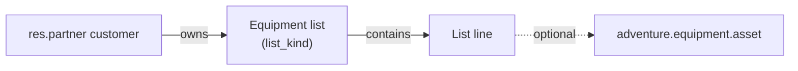
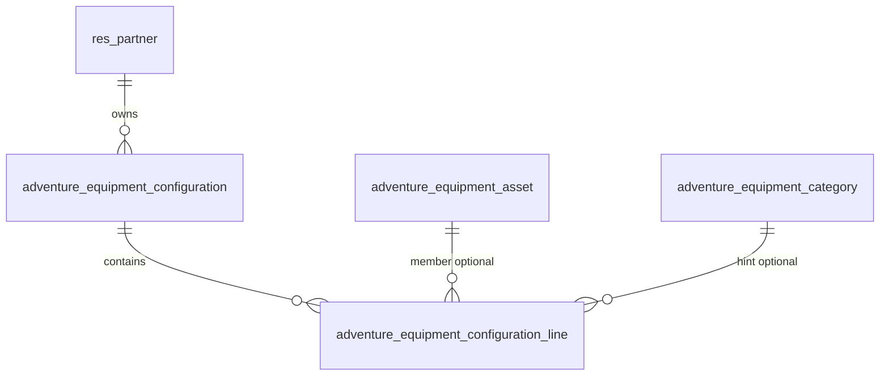
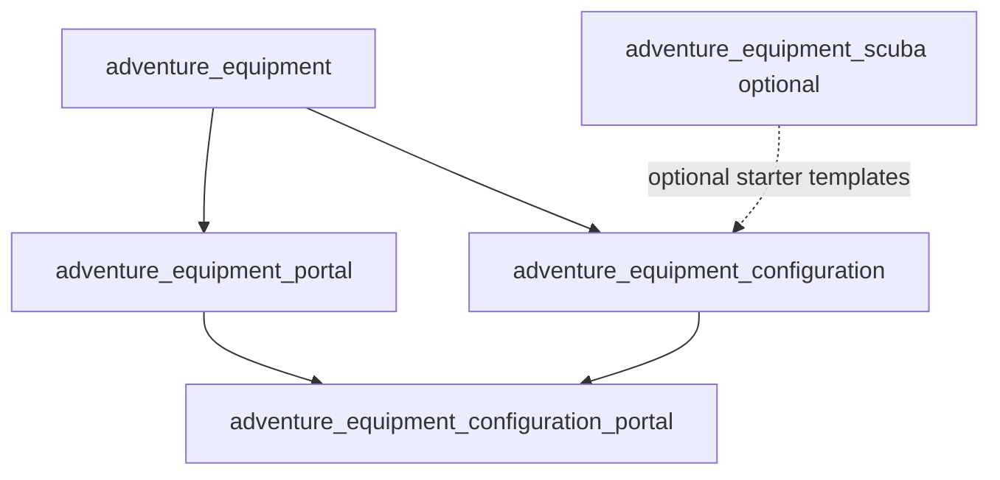

# Equipment lists & configurations (portal)

!!! warning "Design only — not implemented"

    This page proposes **packing lists** and **equipment configurations (kits)** for the customer portal, refining Phase 6 of [Equipment management](equipment-management.md). Do **not** implement until product signs off on the decisions below. Core registry, service/scuba packs, and equipment portal MVP remain the live baseline.

**Audience:** Product, operations, and developers planning customer-facing equipment lists on the Adventure POS portal.

**Related:**

- [Equipment management](equipment-management.md) — ELM module family; Phase 6 `adventure_equipment_configuration`; configuration / scenario / readiness entities
- [Client web portal](client-web-portal.md) — Odoo Website + Portal pattern; equipment portal MVP (list/detail/register); kits **deferred** from first portal slice
- [Equipment data model](../data-model/equipment.md) — shipped registry / service models
- [Tidewater demo seed](tidewater-demo-seed.md) — module-owned contributors for demo coverage
- Live portal: [`adventure_equipment_portal`](https://github.com/bsileo/adventure-pos-odoo/tree/develop/addons/adventure_equipment_portal) (`/my/equipment`)

**Published docs:** once merged, this page appears on [Event Ops Developer Docs](https://bsileo.github.io/adventure-pos-odoo/).

---

## Purpose

Enable customers to create and maintain **named lists that reference their equipment** (and, for packing, non-asset reminders) from the end-user portal—without inventing a second equipment registry or a separate frontend app.

Two primary use cases drive the design (scuba-first, sport-agnostic core):

| Use case | Customer intent | Example |
|----------|-----------------|---------|
| **Packing list** | “What do I bring for this kind of trip?” | Cold-water trip, quarry day, warm-water travel |
| **Configuration (kit)** | “What gear do I actually run together as one setup?” | Cold-water config: dry suit + AL80 + 12 lb + primary reg; notes evolve over time |

Both are **customer-owned**, partner-scoped lists. Staff may view/help in the backend later; the first valuable surface is the **portal**.

---

## Current baseline (what already exists)

| Layer | Status | Implication for lists |
|-------|--------|------------------------|
| `adventure.equipment.asset` registry | **Shipped** | List lines should reference assets by id; snapshots/history stay on the asset |
| Service / scuba packs | **Shipped** | Readiness / overdue surfacing is a **later** list enhancement, not MVP |
| `adventure_equipment_portal` | **MVP in progress** | `/my/equipment` list, detail, edit (nickname/notes), register; portal home card; partner-scoped ACL |
| `adventure_equipment_configuration` | **Named, not built** | Architecture already reserved this module for kits, scenarios, readiness |
| Portal kits / trip prep | **Explicitly deferred** in [client-web-portal](client-web-portal.md) | This design unblocks that deferred slice |

Portal constraints to preserve:

- Odoo Website + Portal Controllers + QWeb (no React SPA)
- Single `partner_id` owner (no household share yet)
- Company-aware record rules
- Customers do not rewrite shop-authoritative fields (serial, verification, service completions)
- Theme-compatible Bootstrap / `o_portal_*` patterns

---

## Product framing: one capability, two list kinds

Treat packing lists and configurations as **one list capability** with a discriminant, not two unrelated apps.

| `list_kind` | Meaning | Line content (MVP) | Primary portal job |
|-------------|---------|--------------------|--------------------|
| **`packing`** | Trip / outing packing checklist | Owned assets **and/or** free-text reminders; optional category hint; per-line notes; check-off | Prepare and reuse trip checklists |
| **`kit`** | Named equipment configuration / setup | Prefer **linked owned assets**; role/label; quantity/amount text (e.g. weight); per-line and list notes | Document “what I dive in this setup” over time |

**Why unify:** shared ownership, ACL, portal IA (“My Gear Lists”), CRUD patterns, Tidewater seed, and staff views. Kind-specific rules stay small (validation, empty states, copy/reset).

**Why not overload assets or tags:** lists are ordered, annotated, multi-member compositions with lifecycle independent of any single asset (retire one tank ≠ delete the cold-water kit).

### Mapping to prior Phase 6 names

| Prior architecture name | This design |
|-------------------------|-------------|
| `adventure.equipment.configuration` | Keep as the **list header** model (or rename display string to “Equipment list”; technical name can stay for continuity) |
| `adventure.equipment.configuration.line` | List membership / line rows |
| `adventure.equipment.scenario` | **Deferred** — shop or platform readiness templates (“Recreational boat dive”) |
| `adventure.equipment.readiness.result` | **Deferred** — evaluate kit vs scenario / service due |

Packing lists are **not** the same as scenarios: a scenario is a reusable *requirement template* for pass/warn/fail; a packing list is the customer’s *personal checklist*. Scenarios may later **seed** packing lists or validate kits.

---

## Decisions proposed (for review)

| # | Proposal | Rationale |
|---|----------|-----------|
| 1 | Ship domain in **`adventure_equipment_configuration`** (name retained from ELM roadmap) | Already reserved; avoids a parallel `adventure_equipment_lists` stack |
| 2 | Model both use cases as one header + lines with **`list_kind` ∈ {`packing`, `kit`}** | Shared portal/ACL; clear UX labels |
| 3 | **Portal-first MVP** for customer CRUD; thin staff backend list/form in the same module | Matches “end user portal” priority; staff visibility for support |
| 4 | Portal routes live in a **thin bridge** `adventure_equipment_configuration` → depends on `adventure_equipment` + `portal`/`website`, **or** extend via optional install that also depends on `adventure_equipment_portal` for home-card continuity | Keep staff-only registry shops free of Website; see [Module shape](#module-shape) |
| 5 | Packing lines may be **asset-linked, free-text, or both** (label required if no asset) | Trip lists include “spare batteries”, “passport”, rental reminders not in the registry |
| 6 | Kit lines **should** link an owned asset when possible; allow quantity/label-only lines for consumables (weight) without inventing fake assets | Cold-water “12 lb” is not always a serialized asset |
| 7 | List + line **notes** are first-class (customer-editable); list description/notes track setup changes over time | Explicit product ask |
| 8 | **No** scenario/readiness engine in MVP | Avoid Phase 6 scope explosion; leave hooks |
| 9 | **No** household sharing; same single-owner rule as equipment portal | Consistency with portal decisions |
| 10 | Tidewater seed: sample packing + kit lists on story portal customers | Demo after `seed-tidewater` |
| 11 | Scuba-specific starter templates (optional data) live in **`adventure_equipment_scuba`** or a small scuba data file depending on configuration—not hard-coded only in portal QWeb | Sport-agnostic core |
| 12 | **Never auto-remove list lines** when referenced equipment is archived, retired, or deleted. Keep the line and show a **broken / unavailable reference** indicator so the list stays visibly incomplete until the customer fixes it | Silent removal would hide that the packing list or kit is no longer valid |

---

## Broken references (confirmed)

Losing a piece of gear must **not** quietly rewrite the customer’s lists. Automatic line deletion is incorrect: the list may now be invalid for its intended trip or setup, and the customer needs to see that.

### Rules

| Event on referenced asset | List line behavior | Portal indicator |
|---------------------------|--------------------|------------------|
| **Archived** (`active=False`) | Keep line; `asset_id` still set when readable with `active_test=False` | “Archived” / unavailable badge |
| **Retired / lost / disposed / transferred** (lifecycle) | Keep line; asset still exists | Lifecycle badge (e.g. “Retired”) — treat as **broken for use** on kits/packing |
| **Hard unlink** (rare; prefer archive) | Keep line; `asset_id` cleared via `ondelete='set null'` | **Broken reference** using denormalized snapshots on the line |
| Customer **manually** removes a line | Allowed — explicit edit, not a side effect of asset deletion | — |

**Never:** cascade-delete configuration lines from asset `unlink`/`write`, retirement wizards, or archive hooks.

### Why snapshots on lines

If an asset is hard-deleted, a bare `Many2one` becomes empty and the UI would only show a blank row. Each asset-linked line therefore stores **denormalized identity at link time** (and refreshed on intentional re-link), for example:

- `asset_snapshot_name` / display label
- Optional: category name, nickname, serial snippet

Portal/staff UI always has something to render: “~~Primary AL80~~ — equipment removed” rather than an empty slot.

### List-level health

- Compute (or maintain) list flags such as `has_broken_references` / `is_incomplete` when any asset line is missing, archived, or in a non-usable lifecycle state.
- Surface on **list index** (warning icon / “Needs attention”) and **list detail** (banner: “One or more items are no longer available — this list may be invalid until you update it.”).
- Customer actions: replace asset on the line, convert to a free-text reminder, or remove the line deliberately.

### Staff / merge

Duplicate-asset merge should **repoint** lines to the surviving asset and refresh snapshots—not drop lines. Document in the merge wizard when configurations land.

---

## Domain model (MVP)

Prefer technical names already sketched in equipment architecture; product labels can say “Gear list” / “Packing list” / “Configuration”.

### Equipment list — `adventure.equipment.configuration`

| Field (conceptual) | Notes |
|--------------------|-------|
| `name` | Required; e.g. “Cold water kit”, “Quarry packing” |
| `partner_id` | Owner; required; portal-scoped |
| `company_id` | Company-aware ACL |
| `list_kind` | Selection: `packing` / `kit` |
| `active` | Archive instead of hard delete when possible |
| `description` | Longer customer-facing blurb |
| `customer_note` | Free-form notes (setup history, “switched to steel BP/W in 2025”) |
| `sequence` / `color` (optional) | Portal ordering / light visual cue |
| `line_ids` | One2many lines |
| mail.thread (optional MVP+) | Chatter useful for staff; portal may omit chatter UI initially |

**Deletion:** Prefer archive. Unlink allowed for portal owner on empty/simple lists if product wants hard delete—document choice in implementation.

### List line — `adventure.equipment.configuration.line`

| Field (conceptual) | Notes |
|--------------------|-------|
| `configuration_id` | Parent list |
| `sequence` | Packing order / kit display order |
| `line_type` | `asset` / `text` / `quantity` (MVP triad; extensible) |
| `asset_id` | Nullable; `ondelete='set null'`; must belong to same `partner_id` when set |
| `asset_snapshot_name` | Denormalized label captured when linking (survives asset unlink) |
| `name` | Display label; required when no asset (or always editable override) |
| `category_id` | Optional hint (“Cylinder”) for packing slots without a chosen asset yet |
| `role_code` | Sport-agnostic string (`primary_reg`, `backup_light`, …); scuba may suggest defaults later |
| `quantity` | Float optional (e.g. `12`) |
| `quantity_uom_label` | Char optional (`lb`, `kg`, `cu ft`) — avoid stock UoM dependency in MVP |
| `notes` | Per-line notes |
| `is_checked` | For packing (and optionally kit pre-dive); portal toggle |
| `reference_state` | Computed (or lightly stored): `ok` / `archived` / `unavailable` / `missing` — drives broken-reference UI |
| `company_id` | Related/stored for rules |

**Constraints (MVP):**

- `asset_id.partner_id` must equal list `partner_id` (server-side) when `asset_id` is set
- **Broken-reference policy (confirmed):** do **not** auto-purge lines when an asset is archived, retired, or unlinked; keep the row, preserve snapshots, and mark `reference_state` / list health so the customer sees the list may be invalid ([Broken references](#broken-references-confirmed))
- Kit with zero lines allowed (draft); packing same

### Explicitly out of MVP models

- `adventure.equipment.scenario`
- `adventure.equipment.readiness.result`
- Shared/published shop template library with versioning
- Multi-partner or club lists
- Linking lists to training sessions, trips, or rental reservations (hooks only)

---

## Relationship diagram

---

## Module shape

### Recommended split

| Module | Responsibility |
|--------|----------------|
| **`adventure_equipment_configuration`** | Models, ACL/record rules (staff + portal groups), staff list/form, ORM constraints/tests, Tidewater domain seed contributor |
| **Portal UX** | Controllers + QWeb + portal home card + HttpCase |

**Portal packaging (pick one at implementation kickoff):**

| Option | Approach | Pros | Cons |
|--------|----------|------|------|
| **A (recommended)** | Configuration module depends on `adventure_equipment` only for domain; add **`adventure_equipment_configuration_portal`** depending on `adventure_equipment_configuration` + `adventure_equipment_portal` | Clean optional install; portal home inherits existing equipment card patterns; staff kits without Website | Extra thin module |
| **B** | Portal controllers inside `adventure_equipment_configuration` with hard depends on `portal` + `website` | Fewer modules | Forces Website stack to use kits at all |
| **C** | Fold list portal routes into `adventure_equipment_portal` and add hard depend on configuration | One customer portal module | Equipment portal MVP cannot stay registry-only; upgrade coupling |

**Recommendation:** **Option A** — matches “feature modules, not a mega-portal” and keeps today’s equipment portal installable without lists.

Dependency sketch (Option A):

### Staff vs portal

| Actor | MVP capabilities |
|-------|------------------|
| **Portal customer** | CRUD own lists; add/remove/reorder lines; toggle packing checks; edit notes; pick from own assets |
| **Staff (Equipment User)** | Read/write customer lists from backend (support, onboarding help) |
| **Staff (Manager)** | Archive/unlink policies; future template admin |

Portal must **not** allow attaching another customer’s assets (record rules + explicit constraint).

---

## Portal UX design

### Information architecture

Extend authenticated portal (same shell as today):

| Entry | Route (proposed) | Notes |
|-------|------------------|-------|
| Portal home card | “Your Gear Lists” (or “Packing & setups”) | Sibling to “Your Equipment”; show count |
| List index | `/my/equipment/lists` | Filter chips: All / Packing / Configurations |
| List detail | `/my/equipment/lists/<id>` | Lines, notes, actions |
| Create | `/my/equipment/lists/new` | Kind + name |
| Edit header | `/my/equipment/lists/<id>/edit` | Name, notes, description, kind (kind change rare; allow or lock after lines exist) |
| Manage lines | Same detail via POST actions or `/lines` sub-routes | Add asset, add text/quantity line, reorder, check, delete line |

Keep URLs under `/my/equipment/...` so the equipment portal mental model stays one place (“my gear”), even if controllers live in the configuration portal module.

### Index page

- Table or stacked rows: name, kind badge, line count, updated on
- Primary CTA: **Create list**
- Empty state: short explanation of packing vs configuration + CTA
- Optional: duplicate list action (copy packing list for a new trip)

### Detail — packing

- Header: name, notes, **Reset checks**
- Ordered checklist: checkbox, label (asset link or text), notes snippet
- Add: “From my equipment” (multi-select or picker) · “Custom item” · optional category
- Asset rows link through to `/my/equipment/<asset_id>`

### Detail — kit / configuration

- Header: name, customer notes (emphasized—setup journal)
- Ordered members: asset display name, role, quantity label, line notes
- Add from owned equipment; add quantity-only row (weights)
- No requirement to check off items in MVP (optional later “pre-dive check” mode)

### Create flow (keep short)

1. Choose kind: Packing list / Configuration  
2. Name  
3. Land on detail to add lines  

Avoid multi-step wizards in MVP.

### Cross-links from existing equipment UI

| Surface | Enhancement |
|---------|-------------|
| `/my/equipment` | Secondary link: “Gear lists” |
| Asset detail | “Appears on” list names (read-only M2M or search) — **nice-to-have**, not MVP-blocking |
| Portal home | Second `portal_docs_entry` card |

### Visual / implementation notes

- Reuse `portal.portal_layout`, `portal_docs_entry`, Bootstrap utilities (same as equipment portal MVP)
- Do not introduce a parallel design system
- Mobile: checklist rows must be tappable; prefer full-width stacked layout under `md`

---

## Security

Mirror equipment portal patterns:

| Control | Rule |
|---------|------|
| `ir.model.access` | Portal: CRUD on own lists/lines; no unlink on assets from list UI beyond line removal |
| Record rules | `partner_id = user.partner_id` (+ company_ids) on header; lines via parent partner |
| Asset picker | Domain restricted to caller’s assets; server re-check on write |
| HttpCase | Customer A cannot read/write B’s lists; cannot attach B’s asset id by POST tampering |
| Staff | Equipment User/Manager ACLs on same models |

---

## Scuba vertical examples (non-normative)

Starter **packing** ideas (seed or optional templates—not hardcoded UX):

- Warm water travel: mask/fins, reg, computer, light, SMB, reef-safe sunscreen (text), cert cards (text)
- Cold water / quarry: exposure suit, hood/gloves, primary + backup light, reel, weights note, tank(s)
- Warm water boat: lighter exposure, spare mask (text), dive computer, SMB

Starter **kit** ideas:

- Cold water: dry suit asset + cylinder + reg set + “12 lb” quantity line + computer; list note: “Add 2 lb if wearing thick undergarment”
- Travel warm water: travel reg + computer + light; note: “Rent BCD/tank at destination”

Exact Tidewater seed rows belong in the configuration (and optional scuba) contributors when building.

---

## Alignment with equipment Phase 6 & portal roadmap

| Roadmap item | This design |
|--------------|-------------|
| ELM Phase 6 — configurations & scenarios | **Split:** Phase **6A** lists/kits/packing (this page); Phase **6B** scenarios + readiness evaluation |
| Portal deferred “kit/configuration / trip readiness” | 6A delivers kits + packing; readiness stays deferred |
| Service due on portal | Still deferred; 6B or a service-portal slice may show overdue badges on kit members later |
| Training packing emails | [Scuba training](scuba-training-scheduling.md) may later reference or copy customer packing lists—do not couple modules now |

Update [equipment-management.md](equipment-management.md) Phase 6 acceptance to: *Create packing + kit lists; portal CRUD; deferred scenario evaluate*.

---

## Delivery slices

Complexity is relative (S/M/L), not calendar time.

| Slice | Purpose | Complexity |
|-------|---------|------------|
| **L0 — Design approval** | This document; close open questions | S |
| **L1 — Domain module** | `adventure_equipment_configuration`: models, constraints, staff views, security, ORM tests | M |
| **L2 — Portal CRUD** | Configuration portal module: home card, index/detail/create/edit, line add/remove/check/reorder | L |
| **L3 — Tidewater seed** | Sample packing + kit lists for portal story users; document in seed-data | S/M |
| **L4 — Polish** | Duplicate list, asset “appears on”, optional scuba starter templates | S/M |
| **L5 — Scenarios / readiness (6B)** | Separate design refresh; evaluate kit vs template; service overdue lines | L |

---

## Testing strategy

| Layer | Focus |
|-------|-------|
| ORM | Partner integrity on lines; archive/retire/unlink leave lines + snapshots; kind validation; quantity-only lines |
| Security | Portal record rules; staff ACL; HttpCase isolation + asset attachment tampering |
| Portal UX | Create packing + kit; check reset; reorder; empty states; broken-reference badges and list “needs attention” |
| Seed | Idempotent Tidewater contributor; optional sample with an archived asset line for demo |

---

## Risks and mitigations

| Risk | Mitigation |
|------|------------|
| Scope creep into readiness/AI/trip itineraries | Hard MVP boundary: lists + notes + checks only |
| Fake “weight” assets cluttering registry | Quantity/text lines without `asset_id` |
| Portal module coupling | Option A thin portal bridge |
| Broken / orphan lines when assets retire or delete | **Confirmed:** keep lines; snapshots + `reference_state`; list-level “needs attention”; never auto-remove |
| Duplicate concepts (tags vs lists) | Tags remain labels on assets; lists are ordered compositions |
| Customers expecting shop-managed templates first | MVP is personal lists; shop templates are 6B/L4 |

---

## Open questions

Resolve before or during L1:

1. **Module packaging:** Confirm Option A (`*_configuration_portal`) vs B/C.
2. **Kind rename in UI:** “Configuration” vs “Setup” vs “Kit” for customer-facing copy?
3. **Portal unlink:** Soft-archive only, or allow delete?
4. **Reorder UX:** Simple up/down posts vs drag-and-drop (drag is nicer, more JS—prefer up/down in L2)?
5. **Shop-provided starter templates:** Seed-only Tidewater examples, or manager-authored templates customers can copy in L4?
6. **Should `list_kind` be immutable after the first line is added?** (Prevents confused packing↔kit hybrids.)
7. **Weight/quantity:** Is Char `quantity_uom_label` enough, or do dive shops need structured mass fields in scuba pack soon?

---

## Acceptance criteria for “design finalized”

- [ ] Product agrees packing + kit share one list model with `list_kind`
- [x] Broken references: keep lines + indicator; never auto-remove on equipment delete/archive/retire
- [ ] Module packaging option chosen (A/B/C)
- [ ] MVP explicitly excludes scenarios/readiness
- [ ] Portal IA / routes agreed at a conceptual level
- [ ] Tidewater seed expectation agreed
- [ ] Equipment Phase 6 split (6A/6B) reflected in [equipment-management.md](equipment-management.md)
- [ ] MkDocs nav includes this page

---

## Next step after approval

1. Implement **L1** domain module on a feature branch (no portal yet if Option A).
2. Implement **L2** portal CRUD + security tests.
3. **L3** Tidewater lists + demo script extension: homepage → login → equipment → gear lists → packing check / kit notes.
4. Schedule **6B** design only when readiness/scenarios are prioritized.
