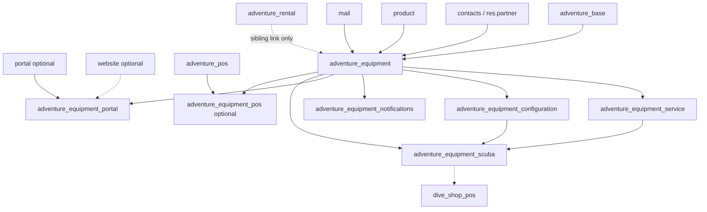

# AdventurePOS Equipment Management Architecture

!!! warning "Partially implemented"

    The **core registry** [`adventure_equipment`](https://github.com/bsileo/adventure-pos-odoo/tree/develop/addons/adventure_equipment), **generic service engine** [`adventure_equipment_service`](https://github.com/bsileo/adventure-pos-odoo/tree/develop/addons/adventure_equipment_service), and **scuba vertical pack** [`adventure_equipment_scuba`](https://github.com/bsileo/adventure-pos-odoo/tree/develop/addons/adventure_equipment_scuba) are **implemented**. **Portal** (`adventure_equipment_portal` + `adventure_website`) is **in progress** on the client web portal workstream. **Configurations / packing lists** ([portal design](equipment-lists-portal.md)), **notifications**, and **POS/sale bridges** remain future work.

    Treat remaining model names and fields on this page as the **platform direction**; compare with the live modules and their READMEs when implementing or testing.

**Audience:** Product, operations, and developers planning Equipment Lifecycle Management as a platform pillar of Adventure POS.

**Related today:**

- [AdventurePOS vertical module architecture](adventurepos-vertical-module-architecture.md) — platform vs vertical packs; rental asset boundary
- [Scuba training and scheduling (future)](scuba-training-scheduling.md) — session equipment needs should later attach to rentals / customer equipment, not duplicate catalogs
- [Core data model](../data-model/core-model.md) — one tenant DB per shop; master catalog vs local operational data
- [Seed data](../seed-data.md) — dive-shop rental fleet seeds (shop-owned assets, not customer equipment)
- Optional pattern reference: [`adventure_waiver`](https://github.com/bsileo/adventure-pos-odoo/tree/develop/addons/adventure_waiver) (provider-neutral domain + connector modules, groups, attachments)

**Canonical path:** this file under `docs/architecture/`. A short pointer also exists at [`docs/equipment-management-architecture.md`](../equipment-management-architecture.md) for prompt/checklist discoverability.

---

## Decisions confirmed (review)

| # | Decision | Status |
|---|----------|--------|
| 1 | Customer-owned equipment is a **separate domain** from shop rental fleet (`adventure.rental.asset`). Do not overload rental assets as customer gear. | **Confirmed** |
| 2 | **Community-first** service records inside Adventure equipment modules. Optional loose links to Enterprise Repair (or similar) only when those apps are installed—never a hard dependency for the core path. | **Confirmed** |
| 3 | Put customer-equipment maintenance in **`adventure_equipment_service`**. Do **not** invent a parallel stack under `adventure_service` until a general shop **work-order / bench** product is explicitly prioritized. The name `adventure_service` in [agent-rules](../agent-rules.md) remains an undefined placeholder only. | **Confirmed** |

Remaining open questions (household sharing, auto-create on sale, etc.) are listed below and do not block documenting Phase 1 as a staff registry.

---

## Vision

AdventurePOS must manage the **complete lifecycle of equipment that customers own**, not only products that were sold.

Unlike traditional retail POS, a cylinder, regulator, computer, or BCD remains a **long-lived business object** after the sale: ownership, service, warranty, documents, configurations, readiness for trips, and recurring shop revenue all attach to that physical item.

Think of this capability as an **Equipment Lifecycle Management (ELM)** platform—closer to fleet or aircraft maintenance systems than to SKU inventory. Every physical piece of customer equipment is durable history: products in the catalog may be archived or replaced; **equipment history must not disappear**.

This platform becomes a major pillar alongside POS, rentals, CRM, courses, events, service, and ecommerce.

### Long-term customer capabilities

- View all equipment they own
- Track service history
- Receive maintenance reminders
- Register equipment purchased elsewhere
- Build equipment configurations (kits / setups)
- Prepare equipment for dive (or other sport) scenarios
- View documents and warranties
- Schedule service
- Receive recommendations
- Manage equipment through the customer portal

### Long-term shop capabilities

- Maintain complete customer equipment histories
- Forecast maintenance demand
- Generate recurring service revenue
- Recommend upgrades
- Track warranty status
- View complete ownership history
- Link equipment to sales, rentals, service, and courses

---

## Goals

| Goal | Intent |
|------|--------|
| **Customer ownership** | First-class records for physical items owned by `res.partner` customers, independent of catalog SKUs. |
| **Service lifecycle** | Policy-driven inspection/service intervals, service records, due dates, and shop workflows that create recurring revenue. |
| **Portal** | Customer self-service for inventory, registration, documents, and (later) scheduling—on Odoo portal/website when enabled. |
| **Recurring revenue** | Make due-service forecasting and service booking a natural shop operating loop, not a side spreadsheet. |
| **Future readiness** | Sport-agnostic core; scuba (and later ski/paddle/etc.) as extension packs; room for configurations, scenarios, AI recommendations, IoT, and vendor integrations without rewriting the core. |
| **Historical permanence** | Ownership, service, warranty, documents, photos, and configuration membership survive product archive/delete and catalog sync churn. |

---

## Non-goals (intentionally deferred)

Do **not** treat these as Phase 1 deliverables:

- Implementing models, views, controllers, menus, or security in this design train
- Replacing or merging shop **rental fleet** assets (`adventure.rental.asset`) into customer equipment
- Full ecommerce storefront for equipment sales
- AI recommendation engines, IoT, or dive-computer live sync
- Cross-tenant equipment sharing (architecture is one shop per database)
- Agency certification card systems (separate from equipment; see training / certification work)
- Automatic legal warranty adjudication with manufacturers
- Multi-shop shared customer equipment across databases
- Building a parallel inventory valuation system for customer-owned items (customer equipment is **not** shop stock)

---

## Existing repository analysis

### Stack and edition

| Item | Finding |
|------|---------|
| **Odoo version** | **19.0** (`Dockerfile`: `FROM odoo:19.0`; compose image `adventure-pos-odoo:19.0`) |
| **Edition baseline** | **Community image** (`odoo:19.0`). Enterprise apps (`sale_renting`, `repair`, `helpdesk`, `appointment`, etc.) are **not assumed installed**. Designs must stay Community-first with **optional bridges** when Enterprise modules are present. |
| **License on custom modules** | `LGPL-3` across Adventure addons |
| **Python deps** | Minimal (`rapidfuzz`, `openpyxl` in `requirements.txt`) — no equipment-specific libs |

### Custom module layout (as of this writing)

Present under `addons/`:

| Module | Role relevant to equipment |
|--------|----------------------------|
| `adventure_base` | Thin base dependency (`depends: base`); little domain yet |
| `adventure_pos` | POS shell, OWL mode registry; depends `contacts`, `product`, `point_of_sale`, `sale`, `stock` |
| `adventure_rental` | **Shop-owned rental fleet** models + POS rental/pickup/return prototypes |
| `dive_shop_pos` | Scuba vertical pack (currently seeds + dependency glue; scuba rental fields largely still design/seed JSON) |
| `adventure_product_category` | Catalog category matching / vendor import helpers |
| `adventure_waiver` / `adventure_smartwaiver` | Provider-neutral domain + connector pattern (good template for equipment vendor connectors later) |
| `adventure_d360_migration` | D360 partner/history import; serial numbers on **history lines**, not customer equipment assets |
| **`adventure_equipment`** | **Implemented (Phase 1):** customer-owned equipment registry — assets, categories, ownership history, identifiers, staff UI |

**Not present (future):** `adventure_service`, `adventure_equipment_portal`, `adventure_equipment_configuration`, `adventure_equipment_notifications`, `adventure_equipment_pos`, portal/website custom modules, repair/maintenance custom modules.

**Doc drift note:** [agent-rules](../agent-rules.md) still lists `adventure_rental` under “Future modules,” but the module **already exists** in the tree (scaffolding). Equipment design must treat rental as a **sibling domain**, not invent a second fleet model under another name.

### Frontend

- POS custom UI: **Odoo 19 OWL** + QWeb templates + POS asset bundles (`point_of_sale._assets_pos`)
- Backend JS: sparse (e.g. D360 partner actions)
- **No React/Tailwind app**; do not introduce one for equipment staff UI
- Portal/website: **not implemented** in custom addons; future customer UI should use Odoo **portal** / **website** Controllers + QWeb (Community)

### Rental architecture (must not conflate)

[`adventure_rental`](adventurepos-vertical-module-architecture.md#adventure_rental) already defines:

- `adventure.rental.asset` — shop rentable serialized/pooled assets (`product_id`, optional `stock.lot`, barcode, state, condition, `service_due_date`, JSON `requirement_payload`)
- Reservations, lines, packages, condition logs, fee rules, maintenance events
- Hook methods on reservations for vertical validation
- POS modes: Rental / Pickup / Return (partially sample-data driven)

**Customer equipment is a different ownership and security domain.** Shared *concepts* (serial, service due, condition, photos) may later share mixins or services; **records must not be the same model** as rental assets in Phase 1.

### Service / repair / maintenance in-repo

- No `adventure_service` implementation
- Rental has `adventure.rental.maintenance.event` for **fleet** holds/repairs/inspections
- No dependency on Odoo `repair` or `maintenance` apps in manifests
- Architecture recommendation: **Adventure equipment service records as first-class domain**; optionally link to Odoo Repair/Maintenance/Helpdesk/Appointment **when those apps are installed**, without requiring them for Community tenants

### Security conventions

Mature pattern in `adventure_waiver`:

- `ir.module.category` + Odoo 19 `res.groups.privilege`
- Groups: User (read) / Manager (CRUD)
- `ir.model.access.csv` only; **no portal record rules yet**
- Rental currently grants broad `base.group_user` CRUD (simpler/scaffold)

Equipment should follow **waiver-style privilege groups** plus **portal record rules** from the first portal-capable phase.

### Testing conventions

- `odoo.tests.common.TransactionCase` unit/ORM tests under `addons/*/tests/`
- Present coverage: waiver matching/upsert, smartwaiver upsert, D360 import
- No HttpCase/portal tests yet; recommend adding them when portal lands

### Documentation structure

- MkDocs Material site; architecture under `docs/architecture/`
- Future designs use warning admonitions (see scuba training)
- Documentation-first workflow is mandatory in agent rules

### Naming conventions

- Modules: `adventure_*` (vertical packs may use `dive_shop_*` / future `ski_shop_*`)
- Models: dotted `adventure.<domain>.<entity>`
- Versions: `19.0.x.y.z`
- Commits: conventional (`feat(equipment): …`, `docs(architecture): …`)

### Coding / extension standards

- Inheritance and registries over core forks
- JSON payloads allowed early; promote to real fields when reporting needs harden (FareHarbor / rental / training pattern)
- Configuration as code for agreed settings
- One operational DB per tenant; master catalog separate

---

## Critical architectural principles

1. **Separate Products from Equipment** — Catalog SKUs (`product.template` / `product.product`) are sellable definitions. Equipment assets are **physical owned instances**.
2. **Equipment outlives catalog changes** — Soft links to products; snapshot denormalized identity fields; never cascade-delete history when a product is archived.
3. **Use Odoo where appropriate** — Reuse partners, products, sale/POS orders, `stock.lot` when useful, `mail`, `ir.attachment`, portal/website; do not duplicate them.
4. **Platform capability, not POS buried logic** — Family of `adventure_equipment_*` modules; POS only creates/links.
5. **Sport-agnostic core** — Scuba-specific fields and policies live in `adventure_equipment_scuba` (or `dive_shop_pos` glue), not in core.
6. **One tenant per database** — Local customer equipment only; no cross-tenant queries.

---

## Module architecture

### Proposed module list

| Module | Purpose | Install when |
|--------|---------|--------------|
| **`adventure_equipment`** | Core domain: assets, categories, ownership, identifiers, documents/images metadata, events, basic staff UI | Any shop using customer equipment |
| **`adventure_equipment_service`** | **Implemented (Phase 3A):** generic service types, policies, requirements, records, date aging cron, staff service UI (sport-neutral; no scuba rules) | Shops doing equipment maintenance forecasting |
| **`adventure_equipment_portal`** | Portal/website controllers, customer UX, portal security | Customer self-service enabled |
| **`adventure_equipment_configuration`** | Kits/configurations, packing lists, membership lines; later scenarios & readiness evaluation ([portal design](equipment-lists-portal.md)) | Configurations / trip packing |
| **`adventure_equipment_notifications`** | Mail templates, cron reminders, activity scheduling | Reminders / campaigns |
| **`adventure_equipment_scuba`** | **Implemented (Phase 3B):** scuba service types/policies (VIP, hydro, regulator/BCD, …), cylinder/regulator asset fields, scuba service-record metadata | Dive shops |
| **`adventure_equipment_pos`** (optional thin) | POS hooks: create equipment from POS sale, open customer equipment from register | POS-driven registration |
| Future sport packs | e.g. ski / paddle extensions | As verticals expand |

**Naming note:** Prefer `adventure_equipment` (not `_core`) to match `adventure_waiver` / `adventure_rental` style. Submodules keep a clear family prefix.

### Why this split

- Shops can adopt **registry-only** without service/portal
- Portal and notifications stay optional (website not required for staff CRM)
- Scuba rules do not pollute climbing/ski tenants
- Mirrors successful **waiver domain + provider connector** and **POS shell + rental + dive vertical** patterns

### Dependency graph (proposed)

**Hard rule:** `adventure_equipment` must **not** depend on `adventure_pos` or `adventure_rental`. POS/rental integrate via optional bridge modules or loose Many2one links from equipment → orders/assets.

### Relationship to future `adventure_service` (resolved)

[agent-rules](../agent-rules.md) lists a future `adventure_service` module name with **no design and no scope**. Confirmed approach:

- **Customer equipment identity, policies, due dates, and service history** live in `adventure_equipment` + `adventure_equipment_service`
- **Do not** create `adventure_service` as a duplicate equipment-maintenance stack
- If the product later needs a general **shop work-order / bench queue** (tech assignment, parts, invoicing across customer gear, rental fleet, and other jobs), introduce that as a separate initiative—likely linking *to* equipment and rental records rather than owning their history

Until then, treat `adventure_service` as an unused placeholder name only.

---

## Domain model

All names are **proposals**. Prefer `adventure.equipment.*` technical names.

### Core entities

#### Equipment Asset — `adventure.equipment.asset`

Long-lived physical item.

Suggested fields (conceptual):

- Identity: `name`, `display_name`, `active`, `state` (`active` / `in_service` / `retired` / `lost` / `transferred_out`)
- Owner: `partner_id` (current owner), company
- Catalog link: `product_id` (nullable), `product_tmpl_id` (nullable), **snapshot** `product_label`, `brand_name`, `model_name`, `category_id`
- Condition: `condition_state`, `notes`
- Dates: `acquired_on`, `retired_on`, `warranty_end_date`
- Source: `acquisition_source` (`pos_sale` / `sale_order` / `manual_shop` / `customer_reported` / `transfer_in` / `migration`)
- Commerce links: `origin_sale_line_id`, `origin_pos_order_line_id` (nullable)
- Optional lot: `lot_id` → `stock.lot` when the shop also tracks that serial in stock (often **not** for customer-owned items)
- Extensibility: `payload` JSON for early vertical attributes
- Chatter: `_inherit` mail.thread / mail.activity.mixin

**Deletion policy:** Prefer archive (`active=False`) + `retired`. Restrict unlink to managers; never cascade-wipe child history.

#### Equipment Category — `adventure.equipment.category`

Sport-agnostic taxonomy (Regulator, Tank, Computer, BCD, Skis, Harness, …). May map loosely to product categories but must remain independent so catalog reorgs do not orphan assets.

#### Ownership History — `adventure.equipment.ownership`

Append-only (or carefully audited) rows:

- `asset_id`, `partner_id`, `date_from`, `date_to`, `change_type` (`sale` / `transfer` / `correction` / `migration`), `notes`, optional document refs

Current owner on the asset is denormalized for search performance; history is source of truth for audits.

#### Equipment Identifier — `adventure.equipment.identifier`

Multiple identifiers per asset:

- `id_type` (`serial` / `manufacturer_serial` / `shop_tag` / `barcode` / `rfid` / `other`)
- `name` (value), `primary`, uniqueness rules scoped by type/category where practical

#### Equipment Document / Image

Prefer **`ir.attachment`** linked to the asset (and optionally ownership/service records), with a thin `adventure.equipment.document` wrapper **only if** metadata is required (doc type: warranty, manual, receipt, VIP sticker photo, hydro cert; validity dates; visibility: staff-only vs portal).

Images are attachments with `res_model` / `res_id`; portal ACL must filter by owner.

#### Equipment Event — `adventure.equipment.event`

Generic timeline (registration, transfer, condition note, portal edit, verification, reminder sent). Complements chatter; useful for structured reporting.

#### Equipment Service Policy — `adventure.equipment.service.policy`

Reusable rules: interval months/years, metric triggers (later), which categories, severity, reminder lead times. Scuba policies (VIP annual, hydro 5-year, regulator annual) live in scuba data XML or scuba module defaults.

#### Equipment Service Requirement — `adventure.equipment.service.requirement`

Computed or materialized “due items” on an asset: next due date, policy link, state (`upcoming` / `due` / `overdue` / `waived`).

#### Equipment Service Record — `adventure.equipment.service.record`

Completed (or in-progress) work:

- Asset, partner, dates, technician, vendor, result, next-due updates
- Optional links: `sale_order_id` / `pos_order_id` / invoice / (optional) repair order
- Attachments: reports, stickers

#### Equipment Configuration — `adventure.equipment.configuration`

Named **equipment list** owned by a partner. Discriminated by `list_kind`:

- **`kit`** — configuration / setup (“Travel set”, “Cold water”) of owned assets (+ quantity lines such as weight)
- **`packing`** — trip packing checklist (assets and/or free-text reminders)

See [Equipment lists & configurations (portal)](equipment-lists-portal.md) for portal UX, MVP boundaries, and Phase 6A vs 6B split.

#### Configuration Membership — `adventure.equipment.configuration.line`

List lines: optional asset link, label, role (`primary_reg`, …), quantity/uom label, notes, packing check state.

#### Scenario — `adventure.equipment.scenario`

Reusable readiness template (“Recreational boat dive”, “Altitude lake”, later “Backcountry ski day”). **Deferred to Phase 6B** (not required for packing/kit portal MVP).

#### Readiness Evaluation — `adventure.equipment.readiness.result`

Snapshot of evaluating a configuration (or partner’s selected assets) against a scenario: pass/warn/fail lines (service overdue, missing component, cert gate deferred to other modules). **Deferred to Phase 6B**.

### Explicit non-entities (avoid early)

- Do not invent a second product catalog
- Do not store customer cylinders as `stock.quant` ownership hacks
- Do not reuse `adventure.rental.asset` as customer equipment

---

## Relationship diagram (ER)

```mermaid
erDiagram
  res_partner ||--o{ adventure_equipment_asset : owns
  product_product ||--o{ adventure_equipment_asset : "catalog link optional"
  adventure_equipment_category ||--o{ adventure_equipment_asset : classifies
  adventure_equipment_asset ||--o{ adventure_equipment_ownership : history
  res_partner ||--o{ adventure_equipment_ownership : "historical owner"
  adventure_equipment_asset ||--o{ adventure_equipment_identifier : identifies
  adventure_equipment_asset ||--o{ adventure_equipment_event : timeline
  adventure_equipment_asset ||--o{ adventure_equipment_document : "meta optional"
  ir_attachment ||--o{ adventure_equipment_document : stores
  adventure_equipment_asset ||--o{ adventure_equipment_service_requirement : due
  adventure_equipment_service_policy ||--o{ adventure_equipment_service_requirement : defines
  adventure_equipment_asset ||--o{ adventure_equipment_service_record : serviced
  adventure_equipment_service_policy ||--o{ adventure_equipment_service_record : "applied optional"
  res_partner ||--o{ adventure_equipment_configuration : owns
  adventure_equipment_configuration ||--o{ adventure_equipment_configuration_line : contains
  adventure_equipment_asset ||--o{ adventure_equipment_configuration_line : member
  adventure_equipment_scenario ||--o{ adventure_equipment_readiness_result : evaluates
  adventure_equipment_configuration ||--o{ adventure_equipment_readiness_result : subject
  sale_order_line ||--o{ adventure_equipment_asset : "origin optional"
  pos_order_line ||--o{ adventure_equipment_asset : "origin optional"
  stock_lot ||--o{ adventure_equipment_asset : "optional link"
```

---

## Odoo integration

| Area | Integration approach |
|------|----------------------|
| **Products** | Optional Many2one + **immutable snapshots** on asset; catalog sync/archive must not delete assets |
| **Sales** | On confirmed SO line for equipment-class products, optional auto-create asset + ownership row; wizard for serial capture. **Phase 1:** `origin_sale_ref` (Char) only — typed `sale.order` / POS line links deferred to `adventure_equipment_pos` / sale bridge |
| **POS** | Bridge module: after paid order, create/link assets; cashier prompts for serial when policy requires (**deferred**; no POS dependency in core) |
| **Stock** | Customer equipment is **not** shop inventory. **`stock.lot` link deferred** in Phase 1 (no `stock` dependency on `adventure_equipment`). Use `stock.lot` only when the same serial is also a shop lot (rare; e.g. consignment edge cases). Do not move customer gear through stock locations as ownership transfer |
| **Portal / website** | `adventure_equipment_portal` Controllers; portal user sees only own partner’s (and family) equipment; QWeb templates |
| **Service** | Adventure service records first; optional Enterprise `repair` link later |
| **Rentals** | Sibling domain. Possible later links: “customer brought own regulator on rental booking” → equipment asset id on rental line payload—not the same as assigning a rental asset |
| **Customers** | `res.partner` form smart button / notebook: Equipment count, due service |
| **Mail** | Thread on asset & service record; reminder templates in notifications module |
| **Attachments** | Standard `ir.attachment`; portal rules critical |
| **Security** | Staff groups + portal record rules (see below) |
| **Master catalog** | Equipment stays **tenant-local**; never synced as master catalog rows |

---

## Security model

### Staff

| Group | Access |
|-------|--------|
| **Equipment User** | Read/write assets & service for daily ops; limited unlink |
| **Equipment Manager** | Full config: categories, policies, force transfers, archive, merge duplicates |
| **POS User** | Via POS bridge: create/link on sale; no policy admin |

Follow Odoo 19 `res.groups.privilege` pattern from waivers.

### Portal

- Portal users: read own equipment; create **customer-reported** registrations (pending verification)
- Portal edit: limited fields (notes, photos, nickname); **not** shop-authoritative service completions
- Record rules: `partner_id` in user partners / commercial child hierarchy (define family sharing explicitly)

### Ownership & verification

- `verification_state`: `shop_verified` / `customer_claimed` / `disputed`
- Shop-verified required before counting toward authoritative warranty/service forecasting used in revenue ops (policy choice)

### Attachments & documents

- Portal-readable flag or document type whitelist
- Staff-only for internal bench notes / cost sheets

### Auditing

- mail.thread + ownership history + equipment events
- Avoid silent partner_id changes; transfers go through wizard that writes history

---

## Lifecycle rules

| Flow | Rule |
|------|------|
| **Sale / POS creation** | Creating an order line for a configured product category/flag may create an asset in `draft`/`active` with ownership history; capture serial when required |
| **Manual shop creation** | Staff creates asset for walk-in gear; mark source `manual_shop` |
| **Customer registration** | Portal creates `customer_claimed` asset; staff verifies serial/photos |
| **External purchases** | Same as customer registration; optional receipt attachment |
| **Transfers** | Wizard: old owner history close + new owner open; keep same asset id |
| **Retirement** | State `retired`; keep history; remove from active configurations |
| **Duplicates** | Manager merge wizard: surviving asset keeps history; identifiers moved; loser archived with pointer |
| **Serial numbers** | Soft uniqueness by category/type; allow duplicates only with manager override + event (real-world collisions / unknown serials) |
| **Shared ownership** | Phase 1: single `partner_id` (**contact-only**; no commercial-partner rollup on smart-button counts). Later: household sharing via partner child or explicit share table—do not invent multi-owner without product decision |
| **Historical preservation** | Unlink restricted; product_id ondelete `set null`; snapshots retained |
| **Catalog product deleted** | Asset remains; snapshot fields remain searchable |

---

## Future extensions

| Extension | How architecture supports it |
|-----------|------------------------------|
| **Configurations / trip packing** | `adventure_equipment_configuration` + portal lists ([design](equipment-lists-portal.md)); scenarios/readiness later |
| **Service forecasting** | Policies + requirements + cron in notifications/service |
| **Dive scenarios / readiness** | Scenario + readiness result; scuba module supplies rules |
| **AI recommendations** | Read-only analytics on assets/service; no core schema dependency |
| **Customer portal** | Isolated module; Community portal |
| **Vendor integrations** | Connector modules (like smartwaiver) writing into core upsert APIs |
| **IoT / dive computers** | Identifiers + payload + event ingest; keep core free of device protocols |
| **Other sports** | New `adventure_equipment_<sport>` packs; same core models |
| **Training / courses** | Training sessions reference required equipment categories or student-owned assets |
| **Rentals** | Optional “customer-owned component used with rental” link |

---

## Performance

### Expected scale (per tenant DB)

| Entity | Order-of-magnitude assumption |
|--------|-------------------------------|
| Partners | 10k–100k |
| Equipment assets | 20k–300k (multiple items per diver) |
| Service records | grows faster than assets |
| Portal traffic | bursty around trip season |

### Recommendations

- Index: `partner_id`, `state`, `category_id`, identifier value+type, `verification_state`, service `next_due_date`
- Avoid heavy stored computed cascades; prefer materialized requirements updated on write/cron
- Portal lists: server-side pagination; defer attachment payloads
- Search: `name`, serial identifiers, partner name via `name_search` overrides carefully
- Do not load full service history on list views; use smart buttons / separate views
- JSON `payload`: fine for sparse vertical attrs; promote hot filters to real indexed columns when needed

---

## Migration strategy

- Module versions `19.0.x.y.z`; bump when schema changes require `-u`
- Prefer additive columns; avoid destructive renames without migration scripts
- When promoting JSON → fields: write `pre-migrate`/`post-migrate` in module `migrations/`
- D360 / historical POS: map serials on history lines to **candidate** equipment assets in a later migration spike (out of Phase 1)
- Never rely on product rows surviving as the only identity for an asset

---

## Testing strategy

| Layer | Focus |
|-------|-------|
| **Unit / ORM** | Ownership transfer, product unlink safety, serial constraints, policy due-date calculation |
| **Security** | Group ACL + portal record rules (HttpCase) |
| **Portal** | Customer can CRUD only allowed fields; cannot see others’ gear |
| **POS bridge** | Creating assets from paid orders; idempotent re-play |
| **Integration** | Sale → asset → service record → reminder activity |
| **Frontend** | OWL POS prompts if added; keep minimal |
| **Migration** | JSON promotion and merge wizard |

Follow existing `TransactionCase` style; add `HttpCase` when portal exists.

---

## Risks and mitigations

| Risk | Mitigation |
|------|------------|
| Conflating rental fleet with customer equipment | **Resolved:** separate models; no shared table in Phase 1 |
| Catalog sync wiping history | Snapshots + `ondelete='set null'`; no cascade from product |
| Premature Enterprise dependency | **Resolved:** Community-first; optional bridges only |
| Portal attachment leaks | Record rules + document visibility flags; security tests |
| Serial uniqueness fights real data | Soft unique + manager override |
| Scope explosion (AI, IoT, configs) | Phased roadmap; core ships without configuration module |
| Duplicate `adventure_service` vs equipment_service | **Resolved:** `adventure_equipment_service` owns gear maintenance; `adventure_service` stays undefined until work-orders are prioritized |
| POS performance | Async/lazy asset creation; do not block checkout on heavy logic |
| Guiding principle tension (“POS first”) | Keep Phase 1 registry thin; defer portal/config until POS+customers stable enough |

---

## Implementation roadmap

Complexity is relative (S/M/L), not calendar time.

### Phase 0 — Architecture approval (this document)

- **Purpose:** Agree boundaries, module list, rental separation, Community-first stance  
- **Deliverables:** Reviewed architecture; open questions resolved or explicitly deferred  
- **Acceptance:** Product/eng sign-off; agent-rules / mkdocs updated to reference this page  
- **Complexity:** S  

### Phase 1 — Equipment registry foundation ✅ **Shipped**

- **Purpose:** Staff can record customer-owned equipment  
- **Module:** [`adventure_equipment`](https://github.com/bsileo/adventure-pos-odoo/tree/develop/addons/adventure_equipment)  
- **Models:** asset, category, ownership, identifier, document/event metadata  
- **UI:** Backend list/form, partner smart button, ownership transfer wizard  
- **Dependencies:** `adventure_base`, `contacts`, `product`, `mail` (no `stock`, `sale`, or `point_of_sale`)  
- **Ownership scope:** **Contact-only** (`partner_id`); partner equipment count does not aggregate child contacts  
- **Deferred from Phase 1:** `stock.lot` link, typed sale/POS origin fields (use `origin_sale_ref` Char), portal, service policies  
- **Acceptance:** Create/archive assets; product archive does not delete assets; ownership history on create; security groups; demo + tests in module  
- **Complexity:** M  

### Phase 2 — Service lifecycle ✅ **Shipped as Phase 3A**

- **Purpose:** Sport-neutral policies, due dates, service records, forecasting  
- **Module:** [`adventure_equipment_service`](https://github.com/bsileo/adventure-pos-odoo/tree/develop/addons/adventure_equipment_service)  
- **Models:** `adventure.equipment.service.type`, `.policy`, `.requirement`, `.record`  
- **UI:** Equipment form service pages; Due Soon / Due / Overdue menus; configuration for types/policies  
- **Dependencies:** `adventure_equipment`, `mail` (no portal/POS/repair/sale/stock)  
- **Behaviors:** Deterministic policy matching + precedence; idempotent requirement sync; warning/due/grace aging via cron batches; overrides/waivers; external + shop service records; asset service rollup **does not** auto-change lifecycle  
- **Docs:** `addons/adventure_equipment_service/doc/SERVICE_ENGINE.md`  
- **Acceptance:** See Phase 3A criteria in the service module completion report; scuba-specific rules deferred to `adventure_equipment_scuba`  
- **Complexity:** M/L  

### Phase 3 — Sale & POS capture

- **Purpose:** Auto/semi-auto registration at purchase  
- **Modules:** `adventure_equipment_pos` (+ sale hooks in core or bridge)  
- **Acceptance:** Paying for configured products can create verified assets with serial prompt; idempotent  
- **Complexity:** M  

### Phase 4 — Portal self-service ✅ **In progress / MVP shipping**

- **Purpose:** Customers view/register gear  
- **Modules:** [`adventure_equipment_portal`](https://github.com/bsileo/adventure-pos-odoo/tree/develop/addons/adventure_equipment_portal), [`adventure_website`](https://github.com/bsileo/adventure-pos-odoo/tree/develop/addons/adventure_website)  
- **Acceptance:** Portal isolation tests; customer-reported → staff verify flow; Tidewater homepage + demo portal users  
- **Complexity:** L  
- **Design:** [Client web portal](client-web-portal.md) 

### Phase 5 — Notifications

- **Purpose:** Reminder emails/activities for upcoming due service  
- **Module:** `adventure_equipment_notifications`  
- **Acceptance:** Cron creates activities/mails per policy lead time; customer opt-out respected  
- **Complexity:** M  

### Phase 6 — Configurations, packing lists & scenarios

Split for delivery clarity ([portal design](equipment-lists-portal.md)):

#### Phase 6A — Packing lists & kits (portal-first)

- **Purpose:** Customer packing checklists and named equipment configurations (setups)  
- **Modules:** `adventure_equipment_configuration` (+ thin `adventure_equipment_configuration_portal` recommended)  
- **Acceptance:** Create packing + kit lists; line notes; packing check-off; portal ACL isolation; Tidewater sample lists  
- **Complexity:** L  
- **Deferred in 6A:** scenario templates, readiness pass/fail engine  

#### Phase 6B — Scenarios & readiness

- **Purpose:** Evaluate kits (or selected assets) against reusable scenarios; surface overdue members  
- **Module:** extends `adventure_equipment_configuration` (and optionally service/scuba rules)  
- **Acceptance:** Build/evaluate scenario; surface overdue / missing component lines  
- **Complexity:** L  
- **Depends on:** 6A  

### Phase 7 — Scuba vertical pack ✅ **Shipped as Phase 3B**

- **Purpose:** VIP/hydro/regulator defaults and scuba asset metadata  
- **Module:** [`adventure_equipment_scuba`](https://github.com/bsileo/adventure-pos-odoo/tree/develop/addons/adventure_equipment_scuba)  
- **Depends:** `adventure_equipment_service`  
- **Delivered:** scuba service types + category policies; cylinder/regulator/BCD/suit/computer fields; VIP/hydro denorm on completed records; demo assets; ORM tests  
- **Deferred:** scenario/readiness kits, `dive_shop_pos` glue, portal VIP submission  
- **Docs:** `addons/adventure_equipment_scuba/doc/SCUBA_PACK.md`  
- **Acceptance:** Cylinder sync creates VIP + hydro requirements; regulator gets annual service policy; generic engine remains sport-neutral  
- **Complexity:** M  

### Phase 8+ — Integrations & intelligence

- Vendor connectors, training links, rental “own gear” links, AI recommendations, IoT  
- **Complexity:** L each; gated behind product priority  

---

## Open architectural questions

**Resolved above:** rental vs customer equipment; Community-first service records; `adventure_equipment_service` owns gear maintenance (`adventure_service` deferred).

Still open (do not block Phase 1 design, but decide before or during the named phase):

1. **Household sharing:** One owner only in Phase 1, or partner-child sharing from the start?
2. **Auto-create on every sale:** Which product categories/flags opt in? Default off vs on for scuba gear categories? *(Phase 3)*
3. **`stock.lot` usage:** **Deferred in Phase 1** (`adventure_equipment` has no stock dependency). Decide before a later phase whether customer gear ever links to shop lots.
4. **Shared mixin later:** Keep permanent separation from rental, or eventually extract a neutral mixin (`adventure_asset_mixin`) for serial/condition helpers only—without merging tables?
5. **D360 equipment migration:** Is there an export of customer-owned tanks/regs, or only sales history serials?
6. **Verification SLA:** Can overdue forecasting include customer-claimed unverified items? *(Phase 2 / 4)*
7. **Document storage limits:** Attachments in DB/filestore quotas for portal photo uploads? *(Phase 4)*
8. **Phase 1 scope:** **Resolved — staff registry only** (no portal); shipped in `adventure_equipment`.

---

## Why this architecture is maintainable and extensible

- **Clear bounded contexts:** Catalog products, shop rental fleet, and customer equipment are separate—preventing the classic POS mistake of overloading stock or product rows with ownership history.
- **Aligns with AdventurePOS platform rules:** Sport-agnostic core + vertical packs; hooks/bridges instead of forking POS; one DB per tenant; documentation-first.
- **Aligns with Odoo practice:** Reuses partners, products, mail, attachments, portal; Community-first; optional Enterprise bridges; inheritance and small modules.
- **Matches existing repo patterns:** Waiver-style module split and security; rental-style JSON-then-promote; MkDocs future-design admonitions; OWL only where POS needs it.
- **Phased delivery:** Shops get value from a registry before portal/AI complexity lands; each module is optionally installable per tenant.
- **History permanence:** Snapshots, restricted unlink, and ownership ledgers protect the business asset that matters—the customer’s gear story—when catalogs churn.

---

## Final recommendation for review

Core platform decisions **(1)–(3) are confirmed** (see [Decisions confirmed](#decisions-confirmed-review)). Phase 1 **`adventure_equipment`** is shipped; extend via `adventure_equipment_*` modules per roadmap phases 2+.
