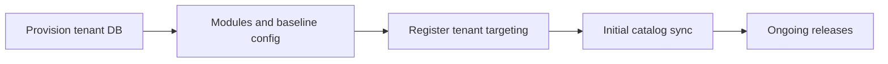

# Tenant Provisioning and Lifecycle

## Status

Draft v0.1 – Operational database lifecycle for Adventure POS shops

## Purpose

This document describes how a **new tenant operational database** is created, configured, connected to the **master catalog**, and maintained through upgrades and eventual offboarding. It complements:

- [`docs/data-model/core-model.md`](../data-model/core-model.md) — one DB per shop, `res.company` inside the tenant DB
- [`docs/architecture/master-catalog-and-sync.md`](master-catalog-and-sync.md) — releases, targeting, initial vs ongoing sync, watermarks

**In scope:** database creation, module installation, baseline Odoo configuration, initial catalog load, hosting patterns (including Odoo.sh considerations), upgrades and migrations, deactivation and offboarding.  
**Out of scope:** detailed sync field ownership and conflict rules (see master-catalog doc), vendor import and normalization (see [`docs/data-model/product-catalog.md`](../data-model/product-catalog.md)).

---

## 1. Terminology

| Term | Meaning |
|------|---------|
| **Tenant** | In this architecture, a **single operational PostgreSQL database** used by one shop (one business). Isolation is primarily at the **database** boundary. |
| **Master catalog environment** | Separate Odoo deployment where canonical products, releases, and tenant targeting are managed. |
| **Tenant registry** | Conceptual store of **metadata** the master (or sync orchestrator) uses: stable tenant id, connection endpoints or job routing, release channel/profile, **last successfully applied release id / version** (watermark). Implementation may be master models, a separate service, or infrastructure config. |
| **Baseline catalog sync** | First application of catalog content to a new tenant, usually a **full or large baseline release** (see master-catalog doc §3.2). |

`res.company` remains important **inside** each tenant DB for normal Odoo behavior (warehouses, fiscal data, POS config); it is not the multi-shop SaaS boundary across tenants.

---

## 2. Lifecycle overview

---

## 3. Creating a new tenant database

### 3.1 What gets created

- A **new database** (empty or from a minimal template) attached to an Odoo instance that runs the Adventure codebase.
- Typical patterns:
  - **Same PostgreSQL cluster, new database** — one Odoo service, many databases (named per tenant).
  - **Dedicated instance per large customer** — stronger isolation; same provisioning steps, different connection targets.

Exact tooling (scripts, Odoo.sh UI, `createdb`, automation) is a **deployment choice**; this document requires only a **unique DB name**, controlled access, and backup policy.

### 3.2 Naming and conventions

- Use a **stable, unique tenant identifier** in the registry (and in master targeting) independent of the PostgreSQL database name if names differ across environments (e.g. `shop_ocean_depths` vs production slug).

### 3.3 Security

- Restrict database credentials per environment; **do not** share superuser roles across unrelated tenants without a documented exception.
- Plan for **encryption at rest** and **network isolation** per hosting provider.

---

## 4. Module installation and baseline configuration

### 4.1 Modules

- Install the **shared Adventure modules** from [`addons/`](../../addons/) plus Odoo dependencies required for retail (e.g. `point_of_sale`, `stock`, `purchase`, `sale` as needed by the product).
- Keep **module lists aligned** with what the master catalog and sync jobs assume (see master-catalog doc §1.2 on version parity).

### 4.2 Baseline checklist

Work through at least the following before going live (exact menus depend on Odoo version):

| Area | Notes |
|------|--------|
| **Company** | Legal name, address, currency, timezone. |
| **Localization / CoA** | Country, fiscal localization, chart of accounts as required for the market. |
| **Warehouses & locations** | Default warehouse, stock locations for POS/stock. |
| **Users & access** | Admin and shop roles; principle of least privilege. |
| **POS** | POS config shell: session, payment methods placeholders, receipt basics (refine before production). |
| **Sequences / journals** | Minimum set for sales and stock moves. |

This list is **operational**, not accounting or legal advice; adjust with a qualified implementer per region.

---

## 5. Initial catalog load

Initial load is **not** ad-hoc product entry for the whole catalog; it is driven by the **master catalog release** model.

### 5.1 Prerequisites

1. Tenant DB exists, modules installed, **baseline company and warehouse** in place (§4).
2. Tenant is **registered for targeting** on the master side: channel, profile, explicit allowlist, or equivalent so the tenant is **eligible** for a published baseline release (see master-catalog doc §4.1).
3. Sync transport and credentials (API user, worker token, etc.) are configured per implementation.

### 5.2 Steps

1. Assign the tenant’s **release channel or profile** (or bind to an explicit **baseline release id** for first run).
2. Run **initial catalog sync** — typically a **full or baseline** payload so the tenant receives a coherent starting catalog.
3. Record the **watermark**: last successfully applied **release id / version** for this tenant in the tenant registry (align with master-catalog doc §4.3 and §10).

### 5.3 Verification

- Smoke checks: product count expectations, sample barcodes, POS can open a session and find representative items.
- Investigate **sync errors** before declaring go-live; partial failure handling is per master-catalog doc §11.

---

## 6. Environment setup — Odoo.sh and alternatives

### 6.1 Local development

- Local Docker-based setup is documented in [`docs/setup.md`](../setup.md). That flow is for **development**, not a substitute for production tenant provisioning.

### 6.2 Odoo.sh-style hosting (architectural)

When using [Odoo.sh](https://www.odoo.sh) or similar managed Odoo hosting:

- **Branches** — e.g. development / staging / production; builds deploy from Git; **promote** tested changes to production.
- **One customer database per shop** (or per contract) matches this project’s **one tenant DB** model.
- **Backups** — rely on platform schedules; test restore periodically.
- **Secrets** — API keys and DB passwords in platform vaults or environment config, **not** in the Git repo (see repo rules).

Exact project layout (separate Odoo.sh projects for master vs tenants, or one project with multiple databases) is a **team deployment decision** and should be documented in runbooks.

### 6.3 Master catalog placement

- The **master catalog** may live on a **dedicated** Odoo.sh project or instance to separate governance workloads from shop traffic. Document the chosen split so sync jobs and firewall rules are clear.

---

## 7. Tenant upgrades and migrations

### 7.1 Code and module upgrades

- Deploy new **code** (Git tag / branch build) to the tenant’s Odoo instance.
- **Upgrade modules** that changed schema or data: Apps → Upgrade, or `odoo -d <database> -u <module> --stop-after-init` as in [`docs/agent-rules.md`](../agent-rules.md) (module upgrade section).
- Keep custom module versions in Odoo-style **`19.0.x.y.z`** format, and use the final segment as the quick in-app dev-change counter.
- Bump **`version`** in `__manifest__.py` when upgrades are required so environments stay auditable.

### 7.2 Ordering

Recommended order:

1. Deploy application code.
2. Run **module upgrades** for affected Adventure modules.
3. Confirm **catalog sync** still succeeds (master and tenant **module parity** — see master-catalog doc §11.3 on drift).

### 7.3 Data migrations

- Prefer Odoo **upgrade hooks** and versioned migration scripts inside modules when schema or data must transform.
- Avoid one-off SQL against production without backup and review.

---

## 8. Deactivation and offboarding

### 8.1 Soft deactivation (typical)

- **Master:** Remove tenant from release targeting or mark inactive so **new releases** no longer apply.
- **Tenant:** Stop scheduled sync jobs; optionally archive company, disable users, set POS to non-operational.
- **Retain** the database for reporting, tax, or legal retention (duration is a **business/legal** decision, not documented here).

### 8.2 Hard offboarding

- **Export** data if contractually required (Odoo export, database dump, accounting extracts).
- **Final backup** before destructive steps.
- **Delete** database or instance only after retention requirements are met.

### 8.3 Master registry

- Keep registry entries **historical** or anonymized identifiers if needed for audit without exposing live connection details.

---

## 9. Operational checklist summary

Use as a single-page runbook for a new shop:

1. **Provision** tenant PostgreSQL database and attach to Odoo with correct access control.
2. **Install** Adventure modules and required Odoo apps.
3. **Baseline** company, localization, warehouse, users, POS shell.
4. **Register** tenant in master targeting (registry) with channel/profile and connection metadata.
5. **Run** initial baseline catalog sync; **record** watermark.
6. **Verify** catalog and POS smoke tests.
7. **Schedule** ongoing sync per master release process.

---

## 10. Change control

Update this document when:

- provisioning steps or hosting assumptions change
- master–tenant registration or initial sync prerequisites change
- offboarding policy changes materially

Related sync semantics changes should stay aligned with [`master-catalog-and-sync.md`](master-catalog-and-sync.md).
