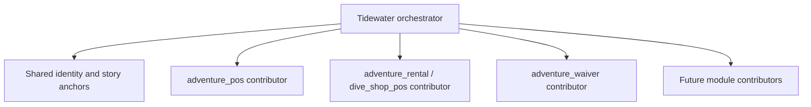

# Tidewater Demo Seed Architecture

## Status

Agreed direction – module-owned Tidewater seed contributors with a thin central orchestrator

## Purpose

**Tidewater Dive Shop** (Pittsburgh, PA) is the canonical fictional tenant for demos, QA, and the shared GCP sandbox (**sandbox-diveshop**). This page defines **how seed data is owned and extended** as modules grow, so Postgres demo state stays coherent without a single monolithic seed dump.

Operational commands and identity tables live in [seed-data.md](../seed-data.md). Agent obligations live in [agent-rules.md — Tidewater demo seed](../agent-rules.md#tidewater-demo-seed-mandatory-for-features).

## Architecture rule

**Module-owned Tidewater contributions + thin central orchestrator.**

- Do **not** put every module’s demo rows into one central mega-seed that hard-depends on optional apps.
- Do **not** let each module invent an unrelated demo company or customer cast.
- Each module that owns models ships a **Tidewater contributor** for those models.
- A **central orchestrator** (today: `dive_shop_pos` seed runner / profile `tidewater`; may later move to a thin dedicated pack) discovers contributors and runs them in dependency order against shared Tidewater identity.

## Ownership split

| Concern | Owner |
|---------|--------|
| Company, slug, place, logo, shared XML-id conventions | Central Tidewater identity (`tidewater_identity` and related) |
| Shared story anchors (named customers, POS config ids others link to) | Central / platform contributor |
| Domain records (rentals, waivers, future training, etc.) | The module that owns those models |
| Optional integration fixtures (e.g. Smartwaiver) | That integration module — only when installed |

## Ongoing development checklist (agents and humans)

When adding or extending a module with user-visible behavior:

1. **Decide ownership** — if new models are required for a useful demo, the Tidewater rows for those models live **in that module** (contributor / seed hook), not bolted into unrelated packs.
2. **Link the story** — reuse Tidewater company and partner XML ids from central identity; do not create a second fictional shop.
3. **Register with the orchestrator** — ensure `seed-tidewater` / sandbox bootstrap runs the new contributor when the module is installed (registry hook or documented inclusion). Skip cleanly when the module is not installed.
4. **Idempotent upserts** — stable XML ids; safe to re-run seed; `--reset-seed` only clears that contributor’s scenario/runtime records.
5. **Schema vs data** — module install/upgrade (`-i` / `-u`) owns DDL; seed owns demo rows. Never use seed to replace a required schema migration.
6. **Document** — update [seed-data.md](../seed-data.md) when operators or agents need to know about new Tidewater surfaces; note exceptions in the PR when seed coverage is deferred.

## Lifecycle (Postgres)

| Event | Expected behavior |
|-------|-------------------|
| Normal `develop` deploy | Code only — **does not** reseed |
| Sandbox DB wipe / bootstrap | Orchestrator runs; installed contributors load Tidewater |
| Explicit reseed | `gcp-sandbox-seed-tidewater` / `make seed-tidewater` upserts |
| New module installed on existing Tidewater DB | Re-run seed (or documented post-install demo hook) so the new contributor adds its rows |
| Module not installed | Its contributor does not run; no broken FK to missing models |

Do **not** auto-mutate production or real customer databases with Tidewater seed.

## Current state vs target

| Today | Target |
|-------|--------|
| Most scuba demo data lives under `dive_shop_pos` seeds | Split by ownership as modules mature; keep orchestrator entrypoint stable |
| Profile aliases `tideledger` / `dive_shop` | Canonical profile remains `tidewater` |
| Manual registration via seed scripts | Formal contributor registry as a second step when more modules seed |

Agents implementing features **now** should still place new module-specific Tidewater data **with that module** (or introduce a clear contributor hook) rather than growing an unrelated dump in `dive_shop_pos` by default—unless the data truly belongs to the dive vertical pack.
