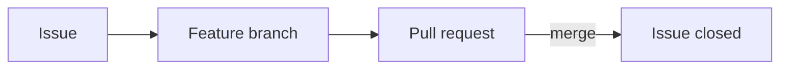

# Development tracking (GitHub Issues & Projects)

This repository uses **GitHub Issues** for work items and **GitHub Projects** (v2) for a shared **Backlog → Done** view. Code changes link to issues via branches and PRs so history stays traceable—important for a small team and for **Cursor / agent** work where clear scope matters.

**Related:** [agent-rules.md](agent-rules.md) (architecture, Git), [developer-onboarding.md](developer-onboarding.md) (Cursor setup).

---

## What you need

- Access to the GitHub repo and permission to create branches and PRs.
- **[GitHub CLI](https://cli.github.com/) (`gh`)** optional but useful: `gh auth login`, then `gh issue`, `gh pr`, and label sync from [scripts/sync-github-labels.ps1](../scripts/sync-github-labels.ps1) or [.sh](../scripts/sync-github-labels.sh).
- **Cursor** (or any editor): same Git workflow; Cursor’s **Source Control** view is optional but convenient (see [Working from Cursor](#working-from-cursor)).

---

## Day-to-day flow

1. **Pick or create an issue** — Prefer an existing open issue; otherwise open one using the templates (**Bug report** or **Feature / task**). Add labels (e.g. `module:adventure_pos`) when you know the area.
2. **Branch from the team’s integration branch** — Usually `develop` if it exists; otherwise the branch your team uses (often `main` only for release—ask if unsure). **Do not commit directly to `main`.**
3. **Name the branch with the issue number** — Example: `feat/pos-42-line-item-notes` or `fix/inventory-17-qty-rounding`.
4. **Implement and push** — Small, reviewable commits; message style `feat(pos): …` per [.cursor/rules/repo.mdc](../.cursor/rules/repo.mdc).
5. **Open a PR** — Use the PR template; set **`Closes #123`** (or `Fixes #123`) so GitHub closes the issue when the PR merges.
6. **Update the Project board** — Move the linked issue through **Ready → In progress → In review → Done** as appropriate (or let maintainers triage).



---

## GitHub Projects (board)

The team maintains a **Project** on GitHub (table or board layout) with columns such as:

| Column | Meaning |
|--------|--------|
| **Backlog** | Not yet ready to start (needs design, priority, or dependency). |
| **Ready** | Clear scope; can be picked up. |
| **In progress** | Someone is actively working on it (ideally one assignee per item). |
| **In review** | PR open; code review. |
| **Done** | Merged (issue closed by PR or manually). |

**New to the board?** Open the repo on GitHub → **Projects** tab → select the Adventure POS project → add your issue or drag cards as status changes.

**First-time setup (maintainers)** — pick one:

- **Browser:** **Projects → New project** → start from **Table** or **Board** → name it (e.g. *Adventure POS development*) → add the columns above → link this repository so issues from `adventure-pos-odoo` appear on the board.
- **GitHub CLI:** Projects need extra token scopes. Run `gh auth refresh -s project,read:project`, then create and link (example for repo owner `bsileo`):

  ```bash
  gh project create --owner bsileo --title "Adventure POS development"
  cd /path/to/adventure-pos-odoo
  gh project list --owner bsileo   # note the project number
  gh project link <NUMBER> --owner bsileo -R bsileo/adventure-pos-odoo
  ```

  Adjust `--owner` if the repo lives under an organization. After linking, open the project on GitHub and add the **Status** field columns (**Backlog**, **Ready**, **In progress**, **In review**, **Done**) to match the table above.

---

## Labels

**Default templates** apply **`bug`** or **`enhancement`** automatically. The team also uses **optional** labels for routing and risk:

| Label | When to use |
|-------|-------------|
| `module:adventure_*` | Which Odoo module is primary (matches folders under `addons/`). |
| `type:chore` | Tooling, docs-only, or refactor without user-visible feature. |
| `risk:db-migration` | Data model or migration risk—extra care on upgrade/test DBs. |
| `agent:ready` | Spec and acceptance criteria are complete enough for an **AI agent** to implement without guessing Odoo behavior. |

**Sync labels to GitHub (once per repo / after clone):** from the repo root, with `gh` authenticated:

```bash
# macOS / Linux / Git Bash
./scripts/sync-github-labels.sh
```

```powershell
# Windows PowerShell
.\scripts\sync-github-labels.ps1
```

Scripts create or update labels; safe to re-run.

---

## Issues: definition of ready

Before moving an issue to **Ready** or marking it **`agent:ready`**:

- One clear **outcome** (what “done” means).
- **Acceptance criteria** listed (checkboxes are fine).
- **Modules or paths** under `addons/` called out when known.
- For bugs: **reproduce steps** and expected vs actual behavior.

Vague tickets are fine in **Backlog**; they get refined before **Ready**.

---

## Branches and commits

- **Branch naming:** include issue id and short slug, e.g. `feat/pos-12-discount-display`, `fix/base-3-manifest`.
- **Commits:** Conventional style, e.g. `feat(pos): add loyalty hook`, `fix(inventory): correct qty on hand`.
- **Integration branch:** match team convention (`develop` vs `main`); onboarding notes: [developer-onboarding.md — Git branches](developer-onboarding.md#git-branches-in-cursor).

---

## Pull requests

- Always **link the issue** in the PR body: `Closes #42` or `Fixes #42`.
- Fill in the PR template (summary, modules touched, testing notes).
- Keep PRs **small** when possible—easier review and safer Odoo upgrades.

---

## Working from Cursor

You can use **any** Git client; the workflow is the same.

### Source Control (built in)

- Open **Source Control** in the sidebar to see changes, stage, commit, and sync.
- Use the **terminal** in Cursor for `git checkout -b …`, `git push -u origin …`, and `gh pr create`.

This matches how [developer-onboarding.md](developer-onboarding.md) describes branches and `.env` hygiene.

### Optional: GitHub in the editor

- The **GitHub Pull Requests** extension (published by GitHub; works in VS Code–compatible editors including Cursor) can list PRs, reviews, and checkouts from the sidebar. Install from the Extensions marketplace if your team wants review workflows inside the IDE.
- **GitLens** (optional) adds blame/history; not required for Issues/Projects.

Cursor does not replace GitHub for **Issues and Projects**—you still create and triage work on github.com (or via `gh issue create` / `gh issue list`).

---

## Agents (Cursor / other)

- Prefer issues labeled **`agent:ready`** with **acceptance criteria** filled in.
- Agents should still follow [agent-rules.md](agent-rules.md): module-first design, no secrets in repo, configuration as code for agreed Odoo settings.
- Humans should **review** agent-produced PRs like any other change—especially for `risk:db-migration` or security-sensitive areas.

---

## File reference

| Path | Purpose |
|------|--------|
| [.github/ISSUE_TEMPLATE/](../.github/ISSUE_TEMPLATE/) | Bug and feature issue templates |
| [.github/pull_request_template.md](../.github/pull_request_template.md) | Default PR description |
| [scripts/sync-github-labels.sh](../scripts/sync-github-labels.sh) | Create/update labels (`gh`) — Unix |
| [scripts/sync-github-labels.ps1](../scripts/sync-github-labels.ps1) | Create/update labels (`gh`) — Windows |

If this workflow changes, update **this file** and [.github/ISSUE_TEMPLATE/config.yml](../.github/ISSUE_TEMPLATE/config.yml) contact links if URLs move.
