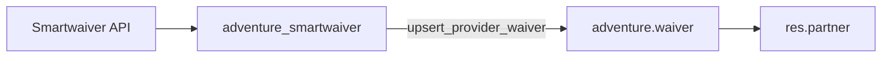

# Smartwaiver ↔ Adventure POS — waiver sync

**Status:** Implemented. Optional provider module `adventure_smartwaiver` on top of generic [`adventure_waiver`](../architecture/adventurepos-vertical-module-architecture.md)-style domain module `adventure_waiver`.

**Vendor:** [Smartwaiver](https://www.smartwaiver.com/) — REST API at `https://api.smartwaiver.com` ([API docs](https://api.smartwaiver.com/api/docs)).

## Module split (provider vs domain)

| Module | Role |
|--------|------|
| `adventure_waiver` | Generic signed-waiver CRM: `adventure.waiver`, partner matching, unmatched queue, menus, PDF hook, provider search hook |
| `adventure_smartwaiver` | Smartwaiver connector: API client, poll/webhook crons, payload mapping → `upsert_provider_waiver`, Settings |

Staff-facing CRM is always **Waivers** (`adventure.waiver`), regardless of provider. Future connectors (e.g. WaiverSign) should follow the same pattern: depend on `adventure_waiver`, `selection_add` on `provider`, map payloads, override hooks — without changing the generic UI.

## Business scenario

- Dive and adventure shops collect signed liability waivers in an external tool.
- Staff need those waivers **inside Adventure POS / CRM** next to the customer (`res.partner`).
- Guests sometimes sign before a customer record exists. Those waivers must still be stored and linked later.

**Primary sync direction (Smartwaiver connector):** Smartwaiver → Odoo (scheduled poll and webhook queue drain).

## Enablement (optional / billable)

1. Install **Adventure Waiver** (`adventure_waiver`) for the CRM domain (usually pulled in by the connector).
2. Install **Adventure Smartwaiver** (`adventure_smartwaiver`) on tenants that use Smartwaiver.
3. Configure the API key under **Settings → Smartwaiver** (or env `SMARTWAIVER_API_KEY`).
4. Cron jobs poll signed waivers and drain the Smartwaiver webhook queue into `adventure.waiver` with `provider=smartwaiver`.

## V1 scope (confirmed)

| In V1 | Out of V1 (later) |
|-------|-------------------|
| Pull / upsert signed waivers by external id | POS checkout warn/block rules |
| Match to `res.partner` by email (then name) | Auto-create partners from waivers |
| Store **unmatched** / **ambiguous** waivers | Dynamic waiver create / prefill / SMS |
| Manual link / unlink | FareHarbor participant cross-link |
| Re-match when a partner gains a matching email | Template-based “required waiver” product rules |
| Partner smart button + waiver menus | Check-ins / group reservations |
| Webhook queue drain + on-demand PDF | Additional providers (e.g. WaiverSign) |

## Partner matching policy

Owned by **`adventure_waiver`** (provider-neutral):

1. Normalize email (lowercase, trim).
2. If the waiver has an email → find partners with that email. **Exactly one** → `matched` / method `email`. **More than one** → `ambiguous`. **None** → `unmatched`.
3. Else try normalized first + last name. **Exactly one** hit → `matched` / method `name`.
4. **Do not** auto-create partners from waivers in V1.
5. Staff may **manually link** (`match_state=manual`).
6. When a partner is created or its email changes, unmatched/ambiguous waivers with that email are **re-matched**.

## Odoo modeling

| Concept | Purpose |
|--------|---------|
| `adventure.waiver` | One row per `(provider, external_id)` |
| `provider` | Extended by connectors (`smartwaiver`, later others) |
| `partner_id` / `match_state` / `match_method` | CRM linkage |
| JSON fields | Participants and custom fields |
| Provider hooks | `_provider_fetch_pdf`, `_provider_search_and_import_for_partner` |

## Smartwaiver API surfaces used

Auth: `Authorization: Bearer <API_KEY>`. Account limit **100 requests/min**; search is separately limited to **5/min**.

| Endpoint | Role |
|----------|------|
| `GET /v4/waivers` | Incremental poll / backfill |
| `GET /v4/waivers/{id}` | Full detail; optional `pdf=true` |
| `GET /v4/search` + results | On-demand search for a partner |
| Webhook queues | Near-real-time ingest via queue drain cron |

## Security and secrets

- Do **not** commit API keys. Prefer Settings → system parameters, or environment variable `SMARTWAIVER_API_KEY`.
- Waiver CRM access groups live on `adventure_waiver`; Smartwaiver Settings are system/admin.

## Related docs

- [Vertical module architecture](../architecture/adventurepos-vertical-module-architecture.md) — generic vs connector pattern
- [FareHarbor POS sync](fareharbor-pos-sync.md) — partner resolution pattern
- [Core model](../data-model/core-model.md) — tenant-local `res.partner`
- Published site: [Event Ops Developer Docs](https://bsileo.github.io/adventure-pos-odoo/)
