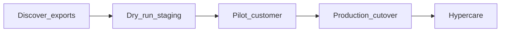

# Migration phases, checkpoints, and rollback triggers

**Scope:** Dive Shop 360 → Adventure POS tenant database (and master catalog when applicable).

## Phases

| Phase | Goal | Exit criteria |
|-------|------|----------------|
| **Discover** | Complete [dive-shop-360-export-inventory.md](dive-shop-360-export-inventory.md); signed mapping draft | All must-have objects have path + sample |
| **Dry run** | Full import on **staging** DB | [validation-report-template.md](validation-report-template.md) passes tolerances |
| **Pilot** | One friendly production-like shop | Sign-off from shop + accountant |
| **Production cutover** | Follow [runbook-cutover-weekend.md](runbook-cutover-weekend.md) | POS smoke tests green |
| **Hypercare** | Stabilization window | [training-hypercare-checklist.md](training-hypercare-checklist.md) items closed |

## Checkpoints

- **C1 — Mapping freeze** — After C1, only critical fixes to transforms (document change control).
- **C2 — Dry-run pass** — [idempotency-test-procedure.md](idempotency-test-procedure.md) succeeded.
- **C3 — Freeze D360** — No more writes in source; timestamp recorded on export bundle.
- **C4 — Accounting sign-off** — Opening inventory and GL bridge approved.

## Rollback triggers (examples — tune per engagement)

Stop cutover and **do not** declare go-live if any of these are breached **after** final import (thresholds are illustrative):

| Trigger | Example threshold | Action |
|---------|-------------------|--------|
| Stock variance | \> 0.5% of lines or \> N units on top SKUs | Reconcile; re-import or adjust before opening |
| Customer load failure | \> 0.1% required partners failed | Fix root cause; re-run |
| Duplicate detection | Unexpected duplicate products or partners | Stop; fix idempotency keys |
| POS cannot sell | Blocker on payment method or pricelist | Fix or rollback plan |

**Rollback plan:** Document whether rollback means “stay on D360 another day” vs “restore Odoo DB snapshot” before C3. After C3 with sales in Odoo, rollback is usually **forward fix**, not restore.

## Roles

| Role | Checkpoint ownership |
|------|----------------------|
| Implementation lead | C1, C2, technical C4 inputs |
| Shop owner | C3, business acceptance |
| Accountant | C4 approval |
